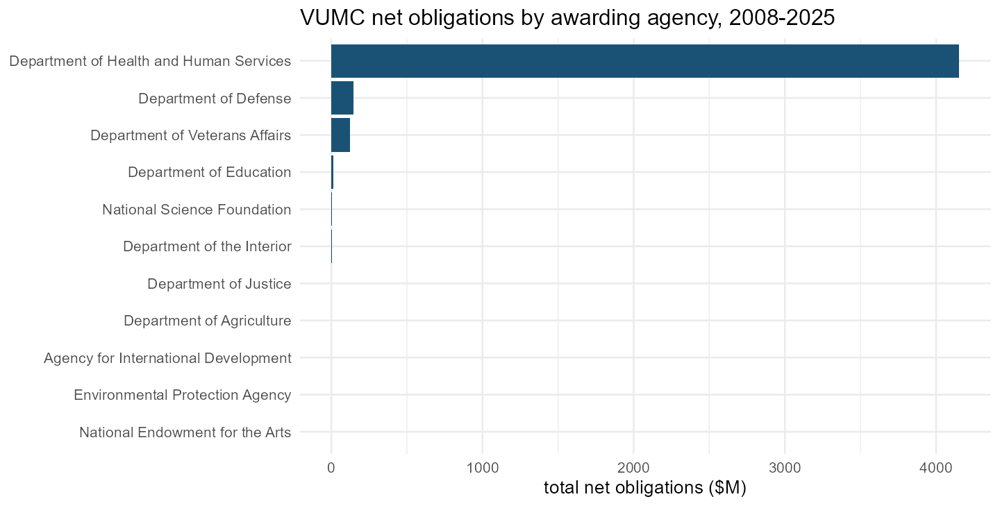
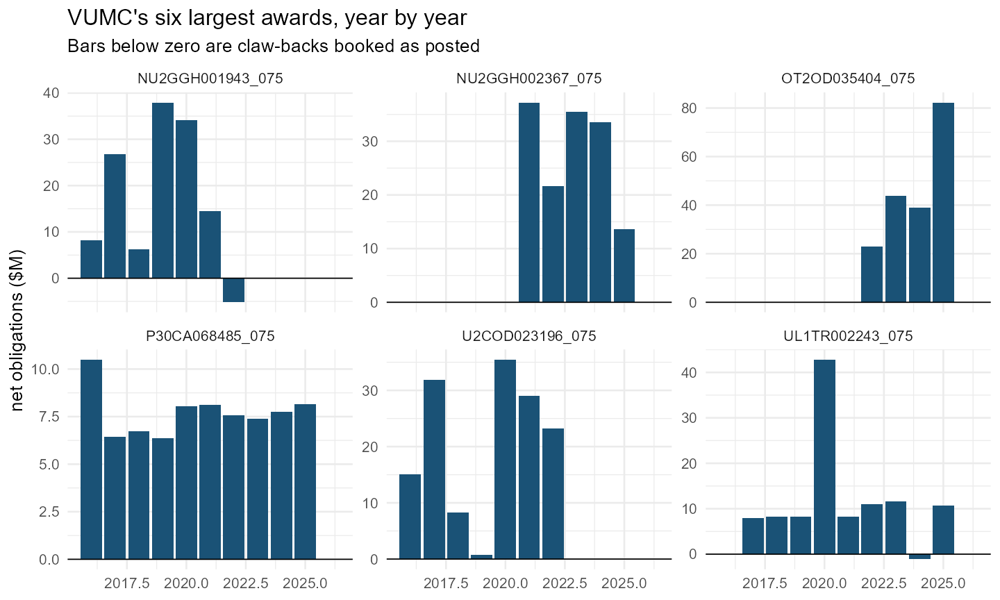
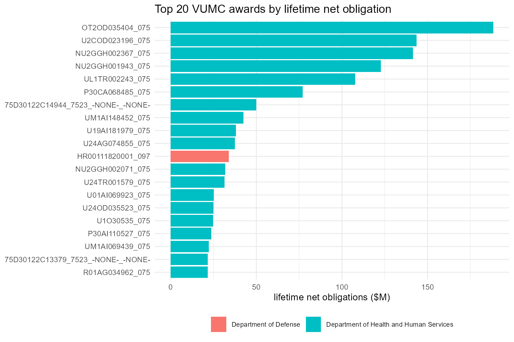
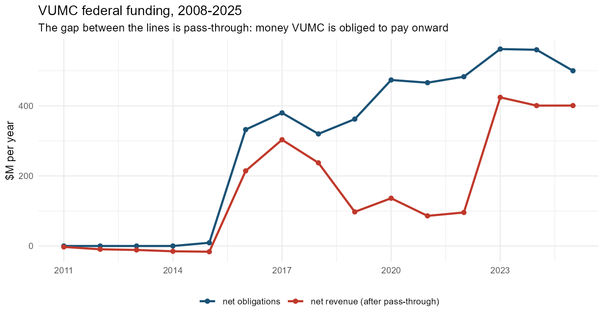

# Accounting: from a raw ledger to net dollars per year

``` r
library(usaspend)
ex <- us_sample_extract()
```

[`us_panel()`](https://nonprofit-open-data-collective.github.io/usaspend/reference/us_panel.md)
runs a fixed sequence of accounting rules between the raw transaction
ledger and the org × award × year panel. This vignette walks the rules
in order, with the measured pilot evidence behind each. (The full
specification lives in the repository’s `ACCOUNTING.md`.)

## 1. Clean the ledger — `us_normalize_transactions()`

``` r
tx <- us_normalize_transactions(ex$transactions)
#> Normalized 120 -> 120 transactions.
#> • 0 duplicates, 0 deleted, 0 aggregate records
#> • 8 rows flagged
```

Five rules, each grounded in the 50-org pilot (302,025 rows):

1.  **De-duplicate on the transaction key.** Download batches overlap
    and one organization’s several UEIs can appear in multiple jobs. The
    pilot carried 6.9% exact duplicates; removing them recovered 5,754
    awards that had been failing the lifetime reconciliation.
2.  **Corrections are kept; deletes are dropped.** Assistance rows carry
    `correction_delete_indicator_code`: `D` withdraws a record; `C`
    marks the row as *being* the current correction. **37.6% of pilot
    assistance rows carry `C`** — a pipeline that misreads `C` as
    “superseded” throws away a third of the ledger.
3.  **Drop county-level aggregate records** (assistance
    `record_type_code`
    1.  — they have no identified recipient and double-count
        entity-level money.
4.  **Keep zero-dollar actions, flagged.** They carry
    period-of-performance changes and they are how activity is counted.
5.  **Flag anomalies, never silently repair** — a non-zero amount on an
    administrative action, dates outside the period of performance, a
    recipient UEI that was never requested.

## 2. The sign is the truth

Action-type labels describe *intent*; the amount’s sign describes what
happened. The sample shows both mismatches at once — a `CONTINUATION`
carrying \$0 and a `REVISION` carrying a claw-back:

``` r
tx[award_key %in% c("ASST_NON_HDTRA12310001_097", "ASST_NON_D8732143_075") &
   action_type_label %in% c("Continuation", "Revision"),
   .(award_key, action_date, action_type_label, federal_action_obligation)][order(award_key, action_date)]
#>                     award_key action_date action_type_label federal_action_obligation
#>                        <char>      <Date>            <char>                     <num>
#> 1:      ASST_NON_D8732143_075  2024-05-13          Revision                   -310999
#> 2: ASST_NON_HDTRA12310001_097  2022-12-16      Continuation                         0
#> 3: ASST_NON_HDTRA12310001_097  2024-02-29      Continuation                    385990
#> 4: ASST_NON_HDTRA12310001_097  2024-06-04      Continuation                    304355
#> 5: ASST_NON_HDTRA12310001_097  2024-08-26          Revision                         0
#> 6: ASST_NON_HDTRA12310001_097  2025-05-06          Revision                         0
#> 7: ASST_NON_HDTRA12310001_097  2025-08-28          Revision                         0
#> 8: ASST_NON_HDTRA12310001_097  2025-09-02          Revision                    300000
```

In the pilot, 8.6% of all transactions are negative, and de-obligations
arrive under **every** action-type label. So the ledger
([`us_ledger()`](https://nonprofit-open-data-collective.github.io/usaspend/reference/us_ledger.md))
classifies money by sign and keeps `action_class` as context — and
negatives are *kept*: dropping them inflates every affected year.

## 3. Net by year, keeping gross and net — `us_net_by_year()`

Every org-award-year carries `obligation_positive`,
`obligation_negative`, and `obligation_net`. A cell netting to \$1M from
+\$5M and −\$4M is a different fact from a clean \$1M, and the panel
never carries the net alone:

``` r
p <- us_panel(ex)
#> Normalized 120 -> 120 transactions.
#> • 0 duplicates, 0 deleted, 0 aggregate records
#> • 8 rows flagged
#> Normalized 32 -> 32 subaward rows (0 duplicates removed).
#> • in=32
p$panel[award_key == "ASST_NON_HDTRA12310001_097",
        .(year, obligation_positive, obligation_negative, obligation_net)]
#>     year obligation_positive obligation_negative obligation_net
#>    <int>               <num>               <num>          <num>
#> 1:  2022              309655                   0         309655
#> 2:  2024              690345                   0         690345
#> 3:  2025              300000                   0         300000
```

## 4. Which year does a claw-back belong to?

The hard question. The sample’s claw-back — \$310,999 reversed in 2024
against money obligated years earlier — can be booked two defensible
ways, and the package implements both rather than choosing silently:

| policy | books the reversal in | character |
|----|----|----|
| `as_posted` (default) | the year it happened | cash-like; matches USAspending’s own presentation; each year reproducible from that year’s transactions |
| `restate` | the year(s) that carried the money, latest-first | accrual-like; but rewrites history as new claw-backs arrive |
| `drop` | nowhere | diagnostic only — measures the overstatement; warns |

``` r
lg <- us_ledger(tx)
om <- us_org_map(ex$meta$uei)
for (pol in c("as_posted", "restate")) {
  g <- us_net_by_year(lg, om, deobligation_policy = pol)
  cat(pol, ":\n")
  print(g[award_key == "ASST_NON_D8732143_075", .(year, obligation_net)])
}
#> as_posted :
#>     year obligation_net
#>    <int>          <num>
#> 1:  2024        -310999
#> restate :
#>     year obligation_net
#>    <int>          <num>
#> 1:  2024        -310999
```

Here the two agree — the obligation being reversed predates this
extract’s window, so `restate` has nothing in-window to push the
reversal onto and correctly leaves it where it was posted. **Measured on
the pilot** (\$118.5bn, 2007–2025): `restate` moves most years by under
1%; the policies genuinely diverge only at the data’s leading edge (2024
−\$460m, 2025 +\$646m), which is where the numbers are still moving
anyway. `as_posted` is therefore a safe default for historical work.
Under it, about 10% of pilot org-award-years net negative — real, and
kept.

## 5. Year basis

`period = "calendar"` (default) books on the calendar year of
`action_date`; `"fiscal"` uses the federal fiscal year (starting 1
October). Both are recomputed from `action_date` rather than trusting
the source’s fiscal-year column, so the two bases are guaranteed
consistent with each other and with the dates.

## 6. What the panel then is

`obligation_net` per org-award-year, minus pass-through where fetched
([`vignette("subawards")`](https://nonprofit-open-data-collective.github.io/usaspend/articles/subawards.md)),
with every rule above checkable after the fact:
[`us_reconcile()`](https://nonprofit-open-data-collective.github.io/usaspend/reference/us_reconcile.md)
tests each award’s summed actions against USAspending’s independently
computed lifetime total
([`vignette("reconciliation")`](https://nonprofit-open-data-collective.github.io/usaspend/articles/reconciliation.md)).

## 7. Inside the object `us_panel()` returns

[`us_panel()`](https://nonprofit-open-data-collective.github.io/usaspend/reference/us_panel.md)
returns a list of class `usaspend_panel` holding six elements. The first
five are tables; `meta` records the choices the build was made under
(year basis, money measure, de-obligation policy, whether outbound
subawards were fetched).

| element | grain | what it is |
|----|----|----|
| `panel` | org × award × year | **the deliverable** — net dollars per award per year |
| `awards` | award | the spine: one row per award with its attributes and lifetime totals |
| `transactions` | award action | the normalized ledger the panel was aggregated from |
| `subawards` | FSRS report line | subaward rows with `direction` assigned (`in`/`out`/`internal`/`unrelated`) |
| `subawards_in` | org × year | subaward revenue *received* — money invisible in prime data |
| `meta` | — | build parameters and provenance |

The previews below use the packaged Vanderbilt University Medical Center
data
([`?vumc_transactions`](https://nonprofit-open-data-collective.github.io/usaspend/reference/vumc_transactions.md)),
rebuilt into a full panel object:

``` r
library(data.table)
data(vumc_transactions); data(vumc_subawards)
ueis <- unique(vumc_transactions$recipient_uei)

ex_v <- structure(
  list(transactions = vumc_transactions, subawards = vumc_subawards,
       jobs = NULL,
       meta = list(uei = ueis, years = 2008:2025, source = "api",
                   subawards = "both", extracted_at = Sys.time())),
  class = "usaspend_extract")

p <- us_panel(ex_v, org_map = data.frame(uei = ueis, org_id = "35-2528741"),
              fill_gaps = TRUE)
```

### 7.1 `panel` — org × award × year

``` r
dim(p$panel)
#> [1] 9290   30
```

| field | meaning |
|:---|:---|
| org_id | Organization id from your crosswalk (EIN here); the unit of analysis. |
| award_key | Generated unique award id (stable, unlike FAIN/PIID). |
| year / year_basis | Calendar or federal fiscal year, recomputed from action_date. |
| award_group / award_family / award_type_code / award_type_label | Contract vs assistance, and the finer type. |
| awarding_agency_code / awarding_agency_name / awarding_sub_agency_name / funding_agency_name | Who awarded and who funded. |
| cfda_number / naics_code / recipient_state | Program, industry, registered state. |
| n_transactions / n_actions_positive / n_actions_negative | Activity counts. n_transactions = 0 marks a fill-gaps placeholder row. |
| obligation_positive / obligation_negative / obligation_net | Gross new money, gross claw-backs, and their sum. Never carried as net alone. |
| deobligation_prior_year | Reversals pushed back by the restate policy (zero under as_posted). |
| loan_face_value / loan_subsidy_cost | Loan amounts; never revenue. |
| subaward_out_amount / n_subawards_out | Pass-through paid onward under this award-year. |
| subaward_in_amount / n_subawards_in | Subawards received under this award (rare at award grain; see subawards_in). |
| net_revenue | obligation_net - subaward_out_amount. |
| flags | Anomaly markers carried from normalization. |

| org_id | award_key | year | year_basis | award_group | award_family | award_type_code | award_type_label | awarding_agency_code | awarding_agency_name | awarding_sub_agency_name | funding_agency_name | cfda_number | naics_code | recipient_state | n_transactions | n_actions_positive | n_actions_negative | obligation_positive | obligation_negative | obligation_net | deobligation_prior_year | loan_face_value | loan_subsidy_cost | subaward_out_amount | n_subawards_out | subaward_in_amount | n_subawards_in | net_revenue | flags |
|:---|:---|---:|:---|:---|:---|:---|:---|:---|:---|:---|:---|:---|:---|:---|---:|---:|---:|---:|---:|---:|---:|---:|---:|---:|---:|---:|---:|---:|:---|
| 35-2528741 | ASST_NON_OT2OD035404_075 | 2025 | calendar | assistance | direct_payment | 06 | Direct Payment for Specified Use | 075 | Department of Health and Human Services | National Institutes of Health | Department of Health and Human Services | 93.310 | NA | TN | 18 | 14 | 2 | 104298454 | -22000000 | 82298454 | 0 | 0 | 0 | 2085963 | 3 | 0 | 0 | 80212491 |  |
| 35-2528741 | ASST_NON_OT2OD035404_075 | 2023 | calendar | assistance | direct_payment | 06 | Direct Payment for Specified Use | 075 | Department of Health and Human Services | National Institutes of Health | Department of Health and Human Services | 93.310 | NA | TN | 10 | 6 | 2 | 73179965 | -29284800 | 43895165 | 0 | 0 | 0 | 0 | 0 | 0 | 0 | 43895165 |  |
| 35-2528741 | ASST_NON_UL1TR002243_075 | 2020 | calendar | assistance | grant | 05 | Cooperative Agreement | 075 | Department of Health and Human Services | National Institutes of Health | Department of Health and Human Services | 93.350 | NA | TN | 5 | 4 | 0 | 42851596 | 0 | 42851596 | 0 | 0 | 0 | 2880056 | 3 | 0 | 0 | 39971540 |  |
| 35-2528741 | ASST_NON_OT2OD035404_075 | 2024 | calendar | assistance | direct_payment | 06 | Direct Payment for Specified Use | 075 | Department of Health and Human Services | National Institutes of Health | Department of Health and Human Services | 93.310 | NA | TN | 25 | 6 | 2 | 42748874 | -3637874 | 39111000 | 0 | 0 | 0 | 0 | 0 | 0 | 0 | 39111000 |  |
| 35-2528741 | ASST_NON_U19AI181979_075 | 2024 | calendar | assistance | grant | 05 | Cooperative Agreement | 075 | Department of Health and Human Services | National Institutes of Health | Department of Health and Human Services | 93.855 | NA | TN | 1 | 1 | 0 | 38056004 | 0 | 38056004 | 0 | 0 | 0 | 27457065 | 19 | 0 | 0 | 10598939 |  |
| 35-2528741 | ASST_NON_NU2GGH001943_075 | 2019 | calendar | assistance | grant | 05 | Cooperative Agreement | 075 | Department of Health and Human Services | Centers for Disease Control and Prevention | Department of Health and Human Services | 93.067 | NA | TN | 20 | 5 | 0 | 37954626 | 0 | 37954626 | 0 | 0 | 0 | 115136146 | 3 | 0 | 0 | -77181520 |  |
| 35-2528741 | ASST_NON_NU2GGH002367_075 | 2021 | calendar | assistance | grant | 05 | Cooperative Agreement | 075 | Department of Health and Human Services | Centers for Disease Control and Prevention | Department of Health and Human Services | 93.067 | NA | TN | 4 | 3 | 0 | 37234393 | 0 | 37234393 | 0 | 0 | 0 | 3769378 | 21 | 0 | 0 | 33465015 |  |
| 35-2528741 | ASST_NON_U2COD023196_075 | 2020 | calendar | assistance | grant | 05 | Cooperative Agreement | 075 | Department of Health and Human Services | National Institutes of Health | Department of Health and Human Services | 93.310 | NA | TN | 3 | 2 | 0 | 35500635 | 0 | 35500635 | 0 | 0 | 0 | 47315084 | 8 | 0 | 0 | -11814449 |  |
| 35-2528741 | ASST_NON_NU2GGH002367_075 | 2023 | calendar | assistance | grant | 05 | Cooperative Agreement | 075 | Department of Health and Human Services | Centers for Disease Control and Prevention | Department of Health and Human Services | 93.067 | NA | TN | 39 | 3 | 0 | 35465787 | 0 | 35465787 | 0 | 0 | 0 | 7280569 | 24 | 0 | 0 | 28185218 |  |
| 35-2528741 | ASST_NON_NU2GGH001943_075 | 2020 | calendar | assistance | grant | 05 | Cooperative Agreement | 075 | Department of Health and Human Services | Centers for Disease Control and Prevention | Department of Health and Human Services | 93.067 | NA | TN | 10 | 3 | 0 | 34180573 | 0 | 34180573 | 0 | 0 | 0 | 108801400 | 1 | 0 | 0 | -74620827 |  |

### 7.2 `awards` — the spine

One row per award, each attribute taken from the latest action that
reports it (award-level fields are sparse across modifications).

``` r
dim(p$awards)
#> [1] 2166   32
```

| field | meaning |
|:---|:---|
| award_key / award_id / parent_award_id | Generated key, the human FAIN/PIID, and the parent IDV where present. |
| award_group / award_family / award_type_code / award_type_label | What kind of award. |
| recipient_uei / recipient_name / recipient_parent_uei / recipient_state | Recipient as of the latest action. |
| awarding_agency_code / awarding_agency_name / awarding_sub_agency_name / funding_agency_name | Agencies, as of the latest action. |
| cfda_number / cfda_title / naics_code / psc_code | Program and industry classifiers. |
| base_action_date / latest_action_date | First and last observed actions. |
| pop_start_date / pop_end_date | Period of performance. |
| total_obligated / total_outlayed | USAspending’s own lifetime totals — the reconciliation reference (outlays mostly missing pre-2017). |
| potential_value | Ceiling, not money; never summed as revenue. |
| subaward_count / subaward_total | From the award overview endpoint when enriched. |
| n_transactions / n_years / n_recipients | Ledger footprint. n_recipients \> 1 marks awards that moved between institutions. |

| award_key | award_group | award_family | award_type_code | award_type_label | award_id | parent_award_id | recipient_uei | recipient_name | recipient_parent_uei | recipient_state | awarding_agency_code | awarding_agency_name | awarding_sub_agency_name | funding_agency_name | cfda_number | cfda_title | naics_code | psc_code | base_action_date | latest_action_date | pop_start_date | pop_end_date | total_obligated | total_outlayed | potential_value | subaward_count | subaward_total | n_transactions | n_years | n_recipients | obligated_in_extract |
|:---|:---|:---|:---|:---|:---|:---|:---|:---|:---|:---|:---|:---|:---|:---|:---|:---|:---|:---|:---|:---|:---|:---|---:|---:|---:|---:|---:|---:|---:|---:|---:|
| ASST_NON_OT2OD035404_075 | assistance | direct_payment | 06 | Direct Payment for Specified Use | OT2OD035404 | NA | GYLUH9UXHDX5 | VANDERBILT UNIVERSITY MEDICAL CENTER | RYSWHDUU7Q36 | TN | 075 | Department of Health and Human Services | National Institutes of Health | Department of Health and Human Services | 93.310 | TRANS-NIH RESEARCH SUPPORT | NA | NA | 2022-11-01 | 2025-09-26 | 2025-11-01 | 2026-10-31 | 194155882 | 135808269 | NA | NA | NA | 55 | 4 | 1 | 188304619 |
| ASST_NON_U2COD023196_075 | assistance | grant | 05 | Cooperative Agreement | U2COD023196 | NA | GYLUH9UXHDX5 | VANDERBILT UNIVERSITY MEDICAL CENTER | RYSWHDUU7Q36 | TN | 075 | Department of Health and Human Services | National Institutes of Health | Department of Health and Human Services | 93.310 | TRANS-NIH RESEARCH SUPPORT | NA | NA | 2016-07-06 | 2023-10-17 | 2016-07-06 | 2022-12-31 | 143679156 | 41281524 | NA | NA | NA | 28 | 8 | 1 | 143679156 |
| ASST_NON_NU2GGH002367_075 | assistance | grant | 05 | Cooperative Agreement | NU2GGH002367 | NA | GYLUH9UXHDX5 | VANDERBILT UNIVERSITY MEDICAL CENTER | RYSWHDUU7Q36 | TN | 075 | Department of Health and Human Services | Centers for Disease Control and Prevention | Department of Health and Human Services | 93.067 | GLOBAL AIDS | NA | NA | 2021-08-31 | 2025-09-24 | 2021-09-30 | 2026-09-29 | 141454389 | 140281374 | NA | NA | NA | 156 | 5 | 1 | 141454389 |
| ASST_NON_P30CA068485_075 | assistance | grant | 04 | Project Grant | P30CA068485 | NA | GYLUH9UXHDX5 | VANDERBILT UNIVERSITY MEDICAL CENTER | RYSWHDUU7Q36 | TN | 075 | Department of Health and Human Services | National Institutes of Health | Department of Health and Human Services | 93.397 | CANCER CENTERS SUPPORT GRANTS | NA | NA | 2016-06-07 | 2025-09-19 | 1998-09-01 | 2025-08-31 | 122762660 | 34220750 | NA | NA | NA | 57 | 10 | 1 | 77080095 |
| ASST_NON_NU2GGH001943_075 | assistance | grant | 05 | Cooperative Agreement | NU2GGH001943 | NA | GYLUH9UXHDX5 | VANDERBILT UNIVERSITY MEDICAL CENTER | RYSWHDUU7Q36 | TN | 075 | Department of Health and Human Services | Centers for Disease Control and Prevention | Department of Health and Human Services | 93.067 | GLOBAL AIDS | NA | NA | 2016-08-31 | 2022-02-25 | 2016-09-30 | 2021-09-29 | 122688213 | 2071992 | NA | NA | NA | 60 | 7 | 1 | 122688213 |
| ASST_NON_UL1TR002243_075 | assistance | grant | 05 | Cooperative Agreement | UL1TR002243 | NA | GYLUH9UXHDX5 | VANDERBILT UNIVERSITY MEDICAL CENTER | RYSWHDUU7Q36 | TN | 075 | Department of Health and Human Services | National Institutes of Health | Department of Health and Human Services | 93.350 | NATIONAL CENTER FOR ADVANCING TRANSLATIONAL SCIENCES | NA | NA | 2017-05-25 | 2025-08-29 | 2017-06-01 | 2027-02-28 | 118592298 | 70979675 | NA | NA | NA | 33 | 9 | 1 | 107693015 |
| CONT_AWD_75D30122C14944_7523\_-NONE-\_-NONE- | contract | contract | D | Definitive Contract | 75D30122C14944 | NA | GYLUH9UXHDX5 | VANDERBILT UNIVERSITY MEDICAL CENTER | RYSWHDUU7Q36 | TN | 075 | Department of Health and Human Services | Centers for Disease Control and Prevention | Department of Health and Human Services | NA | NA | 541715 | AN42 | 2022-08-30 | 2023-12-14 | 2022-08-30 | 2025-08-31 | 49995944 | 43154785 | NA | NA | NA | 4 | 2 | 1 | 49995944 |
| ASST_NON_UM1AI148452_075 | assistance | grant | 05 | Cooperative Agreement | UM1AI148452 | NA | GYLUH9UXHDX5 | VANDERBILT UNIVERSITY MEDICAL CENTER | RYSWHDUU7Q36 | TN | 075 | Department of Health and Human Services | National Institutes of Health | Department of Health and Human Services | 93.855 | ALLERGY AND INFECTIOUS DISEASES RESEARCH | NA | NA | 2019-12-11 | 2025-08-21 | 2019-12-11 | 2026-11-30 | 42990046 | 32568590 | NA | NA | NA | 60 | 7 | 1 | 42376789 |
| ASST_NON_R01CA092447_075 | assistance | grant | 05 | Cooperative Agreement | R01CA092447 | NA | GYLUH9UXHDX5 | VANDERBILT UNIVERSITY MEDICAL CENTER | RYSWHDUU7Q36 | TN | 075 | Department of Health and Human Services | National Institutes of Health | NA | 93.393 | CANCER CAUSE AND PREVENTION RESEARCH | NA | NA | 2016-05-13 | 2017-08-18 | 2001-09-30 | 2017-03-31 | 42852940 | NA | NA | NA | NA | 2 | 2 | 1 | 952482 |
| ASST_NON_UL1TR000445_075 | assistance | grant | 05 | Cooperative Agreement | UL1TR000445 | NA | GYLUH9UXHDX5 | VANDERBILT UNIVERSITY MEDICAL CENTER | DWH7MSXKA2A8 | TN | 075 | Department of Health and Human Services | National Institutes of Health | NA | 93.350 | NATIONAL CENTER FOR ADVANCING TRANSLATIONAL SCIENCES | NA | NA | 2016-06-22 | 2018-01-12 | 2012-06-27 | 2017-05-31 | 40362265 | NA | NA | NA | NA | 5 | 2 | 1 | 8233388 |

### 7.3 `transactions` — the normalized ledger

Same schema as `vumc_transactions` (see
[`?vumc_transactions`](https://nonprofit-open-data-collective.github.io/usaspend/reference/vumc_transactions.md)
for the full field dictionary) plus the normalization columns:

| field | meaning |
|:---|:---|
| is_zero_dollar | TRUE on \$0 actions — kept, because they carry period-of-performance changes and activity counts. |
| is_deobligation | TRUE where the obligation is negative. |
| is_legacy_cdi | Undocumented correction/delete codes (kept, flagged). |
| is_stray_uei | Recipient UEI was never requested (API text-matching stray). |
| flags | Semicolon-joined anomaly markers (money on an admin action, action after period of performance, …). |

| transaction_key | award_key | parent_award_id | award_group | award_family | award_type_code | award_type_label | award_id | award_id_uri | modification_number | action_date | action_year | action_fiscal_year | action_type_code | action_type_label | action_class | transaction_description | correction_delete_code | record_type_code | federal_action_obligation | pragmatic_obligation | non_federal_funding_amount | loan_face_value | loan_subsidy_cost | award_total_obligated | award_total_outlayed | base_and_all_options_value | recipient_uei | recipient_name | recipient_parent_uei | recipient_state | awarding_agency_code | awarding_agency_name | awarding_sub_agency_code | awarding_sub_agency_name | awarding_office_code | awarding_office_name | funding_agency_code | funding_agency_name | cfda_number | cfda_title | naics_code | psc_code | pop_start_date | pop_end_date | pop_potential_end_date | last_modified_date | source_file | is_zero_dollar | is_deobligation | is_legacy_cdi | is_stray_uei | flags |
|:---|:---|:---|:---|:---|:---|:---|:---|:---|:---|:---|---:|---:|:---|:---|:---|:---|:---|:---|---:|---:|---:|---:|---:|---:|---:|---:|:---|:---|:---|:---|:---|:---|:---|:---|:---|:---|:---|:---|:---|:---|:---|:---|:---|:---|:---|:---|:---|:---|:---|:---|:---|:---|
| 7529_OT2OD035404_OT2OD035404-1318346011_93.368_004 | ASST_NON_OT2OD035404_075 | NA | assistance | direct_payment | 06 | Direct Payment for Specified Use | OT2OD035404 | OT2OD035404-3868273592 | 004 | 2023-08-03 | 2023 | 2023 | C | Revision | revision | NA | C | 2 | -28995165 | -28995165 | 0 | 0 | 0 | 194155882\.0 | 135808269 | NA | GYLUH9UXHDX5 | VANDERBILT UNIVERSITY MEDICAL CENTER | RYSWHDUU7Q36 | TN | 075 | Department of Health and Human Services | 7529 | National Institutes of Health | NA | NA | 075 | Department of Health and Human Services | 93.368 | 21ST CENTURY CURES ACT - PRECISION MEDICINE INITIATIVE | NA | NA | 2022-11-01 | 2024-10-31 | NA | 2023-12-18 | NA | FALSE | TRUE | FALSE | FALSE |  |
| 7529_OT2OD035404_OT2OD035404-381067569_93.368_007 | ASST_NON_OT2OD035404_075 | NA | assistance | direct_payment | 06 | Direct Payment for Specified Use | OT2OD035404 | OT2OD035404-3868273592 | 007 | 2025-04-17 | 2025 | 2025 | C | Revision | revision | NA | C | 2 | -19000000 | -19000000 | 0 | 0 | 0 | 194155882\.0 | 135808269 | NA | GYLUH9UXHDX5 | VANDERBILT UNIVERSITY MEDICAL CENTER | NA | TN | 075 | Department of Health and Human Services | 7529 | National Institutes of Health | NA | NA | 075 | Department of Health and Human Services | 93.368 | 21ST CENTURY CURES ACT - PRECISION MEDICINE INITIATIVE | NA | NA | 2025-11-01 | 2026-10-31 | NA | 2026-02-09 | NA | FALSE | TRUE | FALSE | FALSE |  |
| 7529_UL1TR002243_UL1TR002243-3268941090_93.855_003 | ASST_NON_UL1TR002243_075 | NA | assistance | grant | 05 | Cooperative Agreement | UL1TR002243 | UL1TR002243-3099625403 | 003 | 2024-08-14 | 2024 | 2024 | C | Revision | revision | NA | C | 2 | -11850701 | -11850701 | 0 | 0 | 0 | 118592298\.1 | 70979675 | NA | GYLUH9UXHDX5 | VANDERBILT UNIVERSITY MEDICAL CENTER | NA | TN | 075 | Department of Health and Human Services | 7529 | National Institutes of Health | NA | NA | 075 | Department of Health and Human Services | 93.855 | ALLERGY AND INFECTIOUS DISEASES RESEARCH | NA | NA | 2017-06-01 | 2027-02-28 | NA | 2024-12-16 | NA | FALSE | TRUE | FALSE | FALSE |  |
| 7523_NU2GGH001943_7523-253-NU2GGH001943-01-1-2017-93067-19-1031-NON_93.067_01 | ASST_NON_NU2GGH001943_075 | NA | assistance | grant | 04 | Project Grant | NU2GGH001943 | NU2GGH001943-351105757 | 01 | 2017-01-13 | 2017 | 2017 | C | Revision | revision | NA | C | 2 | -8245876 | -8245876 | 0 | 0 | 0 | 122688212\.7 | 2071992 | NA | GYLUH9UXHDX5 | VANDERBILT UNIVERSITY MEDICAL CENTER | RYSWHDUU7Q36 | TN | 075 | Department of Health and Human Services | 7523 | Centers for Disease Control and Prevention | NA | NA | NA | NA | 93.067 | GLOBAL AIDS | NA | NA | 2016-09-30 | 2021-09-29 | NA | 2017-06-20 | NA | FALSE | TRUE | FALSE | FALSE |  |
| 7530_1L1CMS331549_1L1CMS331549-382587394_93.638_03 | ASST_NON_1L1CMS331549_075 | NA | assistance | grant | 04 | Project Grant | 1L1CMS331549 | 1L1CMS331549-2839150505 | 03 | 2020-06-22 | 2020 | 2020 | C | Revision | revision | NA | NA | 2 | -5597983 | -5597983 | 0 | 0 | 0 | 18873758.8 | NA | NA | GYLUH9UXHDX5 | VANDERBILT UNIVERSITY MEDICAL CENTER | DWH7MSXKA2A8 | TN | 075 | Department of Health and Human Services | 7530 | Centers for Medicare and Medicaid Services | NA | NA | 075 | Department of Health and Human Services | 93.638 | ACA-TRANSFORMING CLINICAL PRACTICE INITIATIVE: PRACTICE TRANSFORMATION NETWORKS (PTNS) | NA | NA | 2015-09-29 | 2019-12-28 | NA | 2020-07-06 | NA | FALSE | TRUE | FALSE | FALSE |  |
| 7523_NU2GGH001943_NU2GGH001943-2296112135_93.067_12 | ASST_NON_NU2GGH001943_075 | NA | assistance | grant | 05 | Cooperative Agreement | NU2GGH001943 | NU2GGH001943-351105757 | 12 | 2022-02-25 | 2022 | 2022 | C | Revision | revision | NA | C | 2 | -5187772 | -5187772 | 0 | 0 | 0 | 122688212\.7 | 2071992 | NA | GYLUH9UXHDX5 | VANDERBILT UNIVERSITY MEDICAL CENTER | RYSWHDUU7Q36 | TN | 075 | Department of Health and Human Services | 7523 | Centers for Disease Control and Prevention | NA | NA | 075 | Department of Health and Human Services | 93.067 | GLOBAL AIDS | NA | NA | 2016-09-30 | 2021-09-29 | NA | 2022-04-07 | NA | FALSE | TRUE | FALSE | FALSE |  |
| 7529_UM1AI148452_UM1AI148452-3034401298_93.855_006 | ASST_NON_UM1AI148452_075 | NA | assistance | grant | 05 | Cooperative Agreement | UM1AI148452 | UM1AI148452-4116651125 | 006 | 2020-09-22 | 2020 | 2020 | B | Continuation | continuation | NA | C | 2 | -4883259 | -4883259 | 0 | 0 | 0 | 42990045.9 | 32568590 | NA | GYLUH9UXHDX5 | VANDERBILT UNIVERSITY MEDICAL CENTER | RYSWHDUU7Q36 | TN | 075 | Department of Health and Human Services | 7529 | National Institutes of Health | NA | NA | 075 | Department of Health and Human Services | 93.855 | ALLERGY AND INFECTIOUS DISEASES RESEARCH | NA | NA | 2020-07-14 | 2022-11-30 | NA | 2021-01-23 | NA | FALSE | TRUE | FALSE | FALSE |  |
| 7529_UM1AI148452_UM1AI148452-3690696324_93.855_002 | ASST_NON_UM1AI148452_075 | NA | assistance | grant | 05 | Cooperative Agreement | UM1AI148452 | UM1AI148452-4116651125 | 002 | 2025-06-30 | 2025 | 2025 | C | Revision | revision | NA | NA | 2 | -4507320 | -4507320 | 0 | 0 | 0 | 42990045.9 | 32568590 | NA | GYLUH9UXHDX5 | VANDERBILT UNIVERSITY MEDICAL CENTER | NA | TN | 075 | Department of Health and Human Services | 7529 | National Institutes of Health | NA | NA | 075 | Department of Health and Human Services | 93.855 | ALLERGY AND INFECTIOUS DISEASES RESEARCH | NA | NA | 2019-12-11 | 2026-11-30 | NA | 2026-02-09 | NA | FALSE | TRUE | FALSE | FALSE |  |
| 7529_7529_HHSN27200004_3_HHSN272201300023I_0 | CONT_AWD_HHSN27200004_7529_HHSN272201300023I_7529 | HHSN272201300023I | contract | contract | C | Delivery Order | HHSN27200004 | NA | 3 | 2017-07-07 | 2017 | 2017 | K | Close Out | closeout | NA | NA | NA | -4481786 | -4481786 | NA | NA | NA | 455440.2 | NA | NA | GYLUH9UXHDX5 | VANDERBILT UNIVERSITY MEDICAL CENTER | RYSWHDUU7Q36 | TN | 075 | Department of Health and Human Services | 7529 | National Institutes of Health | NA | NA | 075 | Department of Health and Human Services | NA | NA | 541712 | AN12 | 2017-07-07 | 2018-09-30 | NA | 2019-04-25 | NA | FALSE | TRUE | FALSE | FALSE |  |
| 7529_7529_HHSN27200005_3_HHSN272201300023I_0 | CONT_AWD_HHSN27200005_7529_HHSN272201300023I_7529 | HHSN272201300023I | contract | contract | C | Delivery Order | HHSN27200005 | NA | 3 | 2017-06-21 | 2017 | 2017 | K | Close Out | closeout | NA | NA | NA | -3879262 | -3879262 | NA | NA | NA | 242208.8 | NA | NA | GYLUH9UXHDX5 | VANDERBILT UNIVERSITY MEDICAL CENTER | RYSWHDUU7Q36 | TN | 075 | Department of Health and Human Services | 7529 | National Institutes of Health | NA | NA | 075 | Department of Health and Human Services | NA | NA | 541712 | AN12 | 2017-06-21 | 2019-12-01 | NA | 2019-04-25 | NA | FALSE | TRUE | FALSE | FALSE |  |

### 7.4 `subawards` — with direction

``` r
p$subawards[, .(rows = .N,
                dollars_m = round(sum(subaward_amount, na.rm = TRUE) / 1e6)),
            by = direction]
#>    direction  rows dollars_m
#>       <char> <int>     <num>
#> 1:        in  2498       613
#> 2:       out  7088      2156
#> 3:  internal    17         4
```

`in` rows are revenue (VUMC as subawardee); `out` rows are pass-through
(VUMC as prime); `internal` rows move money between an organization’s
own UEIs and are excluded from both flows; `unrelated` rows sit on
multi-recipient awards whose current holder is someone else.

| subaward_key | prime_award_key | prime_award_id | prime_uei | prime_name | prime_parent_uei | subawardee_uei | subawardee_name | subawardee_parent_uei | subaward_number | subaward_type | subaward_amount | subaward_action_date | subaward_year | subaward_fiscal_year | report_year | report_month | report_last_modified | prime_award_amount | prime_award_total_outlayed | prime_awarding_agency_name | prime_cfda_numbers | direction | source_file |
|:---|:---|:---|:---|:---|:---|:---|:---|:---|:---|:---|---:|:---|---:|---:|---:|---:|:---|---:|---:|:---|:---|:---|:---|
| ASST_NON_NU2GGH001943_075\|63382\|2021-07-16 | ASST_NON_NU2GGH001943_075 | NU2GGH001943 | GYLUH9UXHDX5 | VANDERBILT UNIVERSITY MEDICAL CENTER | NA | NA | FRIENDS IN GLOBAL HEALTH, LLC | NA | 63382 | sub-grant | 148088036 | 2021-07-16 | 2021 | 2021 | NA | NA | NA | NA | NA | NA | NA | out | api:spending_by_award:subawards |
| ASST_NON_NU2GGH001943_075\|63382\|2020-09-30 | ASST_NON_NU2GGH001943_075 | NU2GGH001943 | GYLUH9UXHDX5 | VANDERBILT UNIVERSITY MEDICAL CENTER | NA | NA | FRIENDS IN GLOBAL HEALTH, LLC | NA | 63382 | sub-grant | 108801400 | 2020-09-30 | 2020 | 2020 | NA | NA | NA | NA | NA | NA | NA | out | api:spending_by_award:subawards |
| ASST_NON_NU2GGH001943_075\|63382\|2019-09-30 | ASST_NON_NU2GGH001943_075 | NU2GGH001943 | GYLUH9UXHDX5 | VANDERBILT UNIVERSITY MEDICAL CENTER | NA | NA | FRIENDS IN GLOBAL HEALTH, LLC | NA | 63382 | sub-grant | 84085876 | 2019-09-30 | 2019 | 2019 | NA | NA | NA | NA | NA | NA | NA | out | api:spending_by_award:subawards |
| ASST_NON_NU2GGH001943_075\|63382\|2016-09-30 | ASST_NON_NU2GGH001943_075 | NU2GGH001943 | GYLUH9UXHDX5 | VANDERBILT UNIVERSITY MEDICAL CENTER | NA | NA | FRIENDS IN GLOBAL HEALTH, LLC | NA | 63382 | sub-grant | 68993088 | 2016-09-30 | 2016 | 2016 | NA | NA | NA | NA | NA | NA | NA | out | api:spending_by_award:subawards |
| ASST_NON_U2COD023196_075\|59306\|2022-07-18 | ASST_NON_U2COD023196_075 | U2COD023196 | GYLUH9UXHDX5 | VANDERBILT UNIVERSITY MEDICAL CENTER | NA | NA | THE BROAD INSTITUTE, INC | NA | 59306 | sub-grant | 35437643 | 2022-07-18 | 2022 | 2022 | NA | NA | NA | NA | NA | NA | NA | out | api:spending_by_award:subawards |
| ASST_NON_NU2GGH001943_075\|63382\|2019-05-14 | ASST_NON_NU2GGH001943_075 | NU2GGH001943 | GYLUH9UXHDX5 | VANDERBILT UNIVERSITY MEDICAL CENTER | NA | NA | FRIENDS IN GLOBAL HEALTH, LLC | NA | 63382 | sub-grant | 31018370 | 2019-05-14 | 2019 | 2019 | NA | NA | NA | NA | NA | NA | NA | out | api:spending_by_award:subawards |
| ASST_NON_U2COD023196_075\|59306\|2022-12-01 | ASST_NON_U2COD023196_075 | U2COD023196 | GYLUH9UXHDX5 | VANDERBILT UNIVERSITY MEDICAL CENTER | NA | NA | THE BROAD INSTITUTE, INC | NA | 59306 | sub-grant | 28646499 | 2022-12-01 | 2022 | 2023 | NA | NA | NA | NA | NA | NA | NA | out | api:spending_by_award:subawards |
| ASST_NON_U2COD023196_075\|59306\|2022-03-10 | ASST_NON_U2COD023196_075 | U2COD023196 | GYLUH9UXHDX5 | VANDERBILT UNIVERSITY MEDICAL CENTER | NA | NA | THE BROAD INSTITUTE, INC | NA | 59306 | sub-grant | 28020677 | 2022-03-10 | 2022 | 2022 | NA | NA | NA | NA | NA | NA | NA | out | api:spending_by_award:subawards |
| ASST_NON_U2COD023196_075\|59306\|2021-04-15 | ASST_NON_U2COD023196_075 | U2COD023196 | GYLUH9UXHDX5 | VANDERBILT UNIVERSITY MEDICAL CENTER | NA | NA | THE BROAD INSTITUTE, INC | NA | 59306 | sub-grant | 27378266 | 2021-04-15 | 2021 | 2021 | NA | NA | NA | NA | NA | NA | NA | out | api:spending_by_award:subawards |
| ASST_NON_NU2GGH001943_075\|63382\|2018-03-29 | ASST_NON_NU2GGH001943_075 | NU2GGH001943 | GYLUH9UXHDX5 | VANDERBILT UNIVERSITY MEDICAL CENTER | NA | NA | FRIENDS IN GLOBAL HEALTH, LLC | NA | 63382 | sub-grant | 25133078 | 2018-03-29 | 2018 | 2018 | NA | NA | NA | NA | NA | NA | NA | out | api:spending_by_award:subawards |

### 7.5 `subawards_in` — inbound revenue by org-year

Money received as a subrecipient never appears in prime award data — an
organization funded purely this way looks like a non-recipient. It is
therefore kept as its own org × year table rather than being forced onto
award rows.

| org_id     | year | subaward_in_amount | n_subawards_in |
|:-----------|-----:|-------------------:|---------------:|
| 35-2528741 | 2023 |           85199179 |            333 |
| 35-2528741 | 2021 |           73491523 |            306 |
| 35-2528741 | 2024 |           72820979 |            340 |
| 35-2528741 | 2019 |           61161059 |            260 |
| 35-2528741 | 2025 |           57006467 |            211 |
| 35-2528741 | 2022 |           52164807 |            323 |
| 35-2528741 | 2020 |           51714450 |            256 |
| 35-2528741 | 2018 |           47194092 |            188 |
| 35-2528741 | 2014 |           44745600 |              1 |
| 35-2528741 | 2017 |           40117765 |            186 |

### 7.6 `meta`

``` r
str(p$meta)
#> List of 6
#>  $ period               : chr "calendar"
#>  $ measure              : chr "obligation"
#>  $ deobligation_policy  : chr "as_posted"
#>  $ subawards_out_fetched: logi TRUE
#>  $ n_orgs               : int 1
#>  $ built_at             : POSIXct[1:1], format: "2026-09-18 10:41:42"
```

## 8. One organization end to end: Vanderbilt University Medical Center

VUMC (EIN 35-2528741) is the packaged example because it exercises every
rule at once: the highest pass-through share in the 50-org pilot,
claw-backs in every year, and both subaward directions at scale.

### 8.1 The raw ledger

``` r
nrow(vumc_transactions)
#> [1] 12085
vumc_transactions[, .N,
  by = .(sign = fcase(federal_action_obligation > 0, "positive",
                      federal_action_obligation < 0, "negative",
                      default = "zero"))]
#>        sign     N
#>      <char> <int>
#> 1:     zero  2816
#> 2: positive  7847
#> 3: negative  1422
```

Of 12085 raw transactions, about a quarter are zero-dollar
administrative actions and 1422 are de-obligations — real claw-backs,
arriving under every action-type label. On the subaward side (after
normalization assigns direction):

``` r
p$subawards[direction %in% c("in", "out"),
            .(rows = .N,
              dollars_m = round(sum(subaward_amount, na.rm = TRUE) / 1e6)),
            by = direction]
#>    direction  rows dollars_m
#>       <char> <int>     <num>
#> 1:        in  2498       613
#> 2:       out  7088      2156
```

### 8.2 What a claw-back looks like

Award `ASST_NON_U54CA280915_075` (an NIH cooperative agreement)
obligates across several years and then loses \$3.8M in a single action.
Note that the sign carries the truth: the claw-back arrives as an
ordinary `REVISION`, not under any special cancellation type.

| modification_number | action_date | action_type_label | action_class | federal_action_obligation | award_total_obligated |
|:---|:---|:---|:---|---:|---:|
| 000 | 2023-06-01 | New | origination | 517353 | 2214328 |
| 000 | 2024-05-21 | Continuation | continuation | 5475798 | 2214328 |
| 001 | 2024-09-24 | Revision | revision | 0 | 2214328 |
| 000 | 2024-12-09 | Revision | revision | 0 | 2214328 |
| 001 | 2025-03-24 | Revision | revision | 0 | 2214328 |
| 002 | 2025-06-23 | Revision | revision | -3778823 | 2214328 |

Summed, the transactions still reconcile to the award’s reported
lifetime total — the claw-back is part of the award’s true value, not
noise:

``` r
vumc_transactions[award_key == "ASST_NON_U54CA280915_075",
                  .(tx_sum = sum(federal_action_obligation),
                    reported = unique(award_total_obligated))]
#>     tx_sum reported
#>      <num>    <num>
#> 1: 2214328  2214328
```

### 8.3 How pass-through is structured

Pass-through is not on the transaction rows at all. It arrives as
separate FSRS report lines keyed to the *prime award*, each naming a
subawardee, an amount, and a commitment date. VUMC’s largest conduit is
`ASST_NON_NU2GGH001943_075` — a CDC global-health cooperative agreement
under which VUMC passes onward far more than it keeps:

| subaward_number | subawardee_name | subaward_amount | subaward_action_date | subaward_year |
|:---|:---|---:|:---|---:|
| 63382 | FRIENDS IN GLOBAL HEALTH, LLC | 148088036 | 2021-07-16 | 2021 |
| 63382 | FRIENDS IN GLOBAL HEALTH, LLC | 108801400 | 2020-09-30 | 2020 |
| 63382 | FRIENDS IN GLOBAL HEALTH, LLC | 84085876 | 2019-09-30 | 2019 |
| 63382 | FRIENDS IN GLOBAL HEALTH, LLC | 68993088 | 2016-09-30 | 2016 |
| 63382 | FRIENDS IN GLOBAL HEALTH, LLC | 31018370 | 2019-05-14 | 2019 |
| 63382 | FRIENDS IN GLOBAL HEALTH, LLC | 25133078 | 2018-03-29 | 2018 |
| 63382 | FRIENDS IN GLOBAL HEALTH, LLC | 7766605 | 2017-10-04 | 2017 |
| GH001943-05-15 | SERVICO DISTRITAL DE SAUDE MULHER E ACCAO SOCIAL DE QUELIMANE | 584268 | 2021-08-09 | 2021 |
| GH001943-05-14 | SERVICO DISTRITAL DE SAUDE MULHER ACCAO SOCIAL DE PEBANE | 205903 | 2021-08-09 | 2021 |
| GH001943-05-12 | SERVICO DISTRITAL DE SAUDE MULHER ACCAO SOCIAL DE NAMACURRA | 205189 | 2021-08-09 | 2021 |

### 8.4 When a placeholder is created

FSRS reports trail the obligations they draw on, so pass-through often
lands in an award-year with no prime activity. With `fill_gaps = TRUE`,
such years get a zero-obligation placeholder row (`n_transactions = 0`)
so the dollars have somewhere to land instead of being dropped:

``` r
p$panel[n_transactions == 0, .N]                      # placeholder rows
#> [1] 1630
p$panel[n_transactions == 0 & subaward_out_amount > 0][
  order(-subaward_out_amount)][1:3,
  .(award_key, year, obligation_net, subaward_out_amount, net_revenue)]
#>                  award_key  year obligation_net subaward_out_amount net_revenue
#>                     <char> <int>          <num>               <num>       <num>
#> 1: ASST_NON_U1OHA30535_075  2022              0            28774870   -28774870
#> 2: ASST_NON_U1OHA30535_075  2021              0            23555440   -23555440
#> 3: ASST_NON_U1OHA30535_075  2020              0            19394827   -19394827
```

### 8.5 The normalized panel

``` r
dim(p$panel)
#> [1] 9290   30
p$panel[, .(awards = uniqueN(award_key)), by = award_group]
#>    award_group awards
#>         <char>  <int>
#> 1:  assistance   1845
#> 2:    contract    321
```

2166 awards collapse to 9290 org-award-year rows, funded by 11 federal
agencies:

``` r
p$panel[, .(awards = uniqueN(award_key),
            net_m = round(sum(obligation_net) / 1e6)),
        by = awarding_agency_name][order(-net_m)]
#>                        awarding_agency_name awards net_m
#>                                      <char>  <int> <num>
#>  1: Department of Health and Human Services   1801  4154
#>  2:                   Department of Defense     98   146
#>  3:          Department of Veterans Affairs    204   124
#>  4:                 Department of Education     14    12
#>  5:             National Science Foundation     21     5
#>  6:              Department of the Interior      1     4
#>  7:                   Department of Justice     19     2
#>  8:         National Endowment for the Arts      4     1
#>  9:               Department of Agriculture      2     1
#> 10:    Agency for International Development      1     1
#> 11:         Environmental Protection Agency      1     1
```



### 8.6 Six awards over their lives



### 8.7 The top 20 awards



### 8.8 The trend, and what pass-through does to it



The two lines are the whole argument for fetching outbound subawards: by
obligations alone, VUMC looks roughly twice as large as the revenue it
actually retains. The finished versions of these tables ship in the
package: `data(vumc_transactions)`, `data(vumc_subawards)`,
`data(vumc_panel)`.
