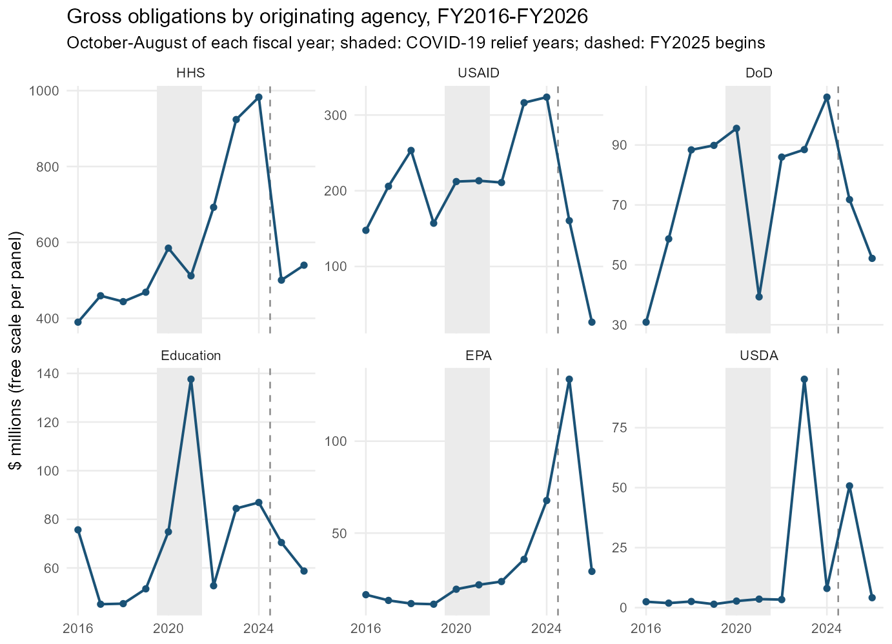
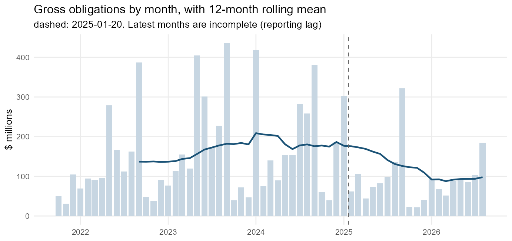
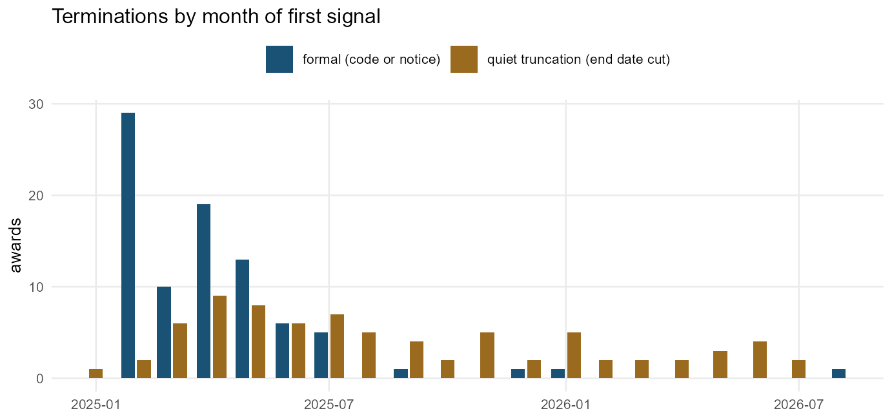
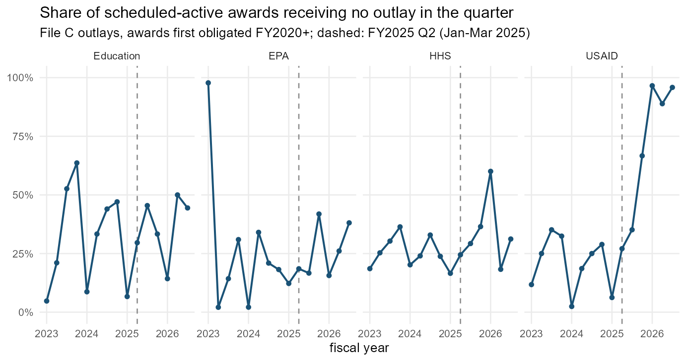

# Detecting disruption in federal funding

When federal funding is disrupted, the first question is usually “how
much money was taken back?” The ledger answers it badly. Terminations
are recorded as notices, the money often stays obligated on paper for
months or years, and much of what happens to a disrupted award is never
formally decided at all: the end date moves up, the next year’s funding
doesn’t arrive, the cash stops. This vignette is a tutorial on reading
those signals — which fields carry them, how to turn them into rates,
and what each kind of disruption looks like in a real award’s history.

It is organized around a four-part taxonomy:

| type | what happens | where it shows up |
|----|----|----|
| **1. Termination** | the award ends early, formally or not | termination action codes and notice text; end dates cut to “now”; early closeouts |
| **2. Reduction** | the award continues, smaller | early de-obligations; ceiling cuts; shortened schedules; missing continuations |
| **3. Delay** | the award continues, later | extensions; administrative actions; late or missing funding actions; active awards with no outlays |
| **4. Transfer** | the work continues under another award, agency, or organization | re-awards; agency changes; transfer actions; novations |

Everything below runs offline on `disruption_sample`, a bundled set of
aggregates and case ledgers from a 1,000-nonprofit pull.

``` r
library(usaspend)
library(data.table)
d <- disruption_sample
str(d$meta[c("sample", "data_end", "t0", "n_orgs_with_awards", "n_awards",
             "n_transactions", "largest_recipient_share")])
#> List of 7
#>  $ sample                 : chr "First 1,000 UEIs of the npmatch 2025NOV nonprofit crosswalk (434 with federal awards)"
#>  $ data_end               : Date[1:1], format: "2026-09-15"
#>  $ t0                     : Date[1:1], format: "2025-01-20"
#>  $ n_orgs_with_awards     : int 434
#>  $ n_awards               : int 15050
#>  $ n_transactions         : int 64255
#>  $ largest_recipient_share: num 0.347
```

**Read the numbers as a worked example, not an estimate.** The sample is
the first 1,000 rows of a nonprofit crosswalk ordered by state, and one
research contractor accounts for 35% of its transactions. The method
generalizes; the magnitudes belong to this portfolio.

## The finding that organizes everything else

Between February and August 2025, formal contract terminations in this
sample went from roughly zero a year to 84. De-obligated dollars did not
follow:

``` r
knitr::kable(d$signals[year >= 2021, .(year,
  term_code_actions = term_code, term_notice_actions = term_text,
  deobligated_M = round(deob_dollars / 1e6, 1),
  early_deob_M  = round(early_deob_dollars / 1e6, 1),
  end_date_cuts = end_cut, ceiling_cut_M = round(ceiling_cut_dollars / 1e6, 1))])
```

| year | term_code_actions | term_notice_actions | deobligated_M | early_deob_M | end_date_cuts | ceiling_cut_M |
|---:|---:|---:|---:|---:|---:|---:|
| 2021 | 0 | 0 | 48.1 | 9.2 | 38 | 132.5 |
| 2022 | 2 | 1 | 23.6 | 12.9 | 26 | 61.4 |
| 2023 | 0 | 3 | 46.6 | 29.7 | 15 | 110.4 |
| 2024 | 0 | 0 | 166.6 | 151.7 | 18 | 15.3 |
| 2025 | 84 | 85 | 97.7 | 28.9 | 95 | 319.2 |
| 2026 | 2 | 8 | 53.7 | 28.0 | 18 | 177.2 |

(The 2024 de-obligation figure is one COVID-19 trial closing out; it is
not a policy signal.) The reason is visible in the terminated awards
themselves:

``` r
t <- d$terminations
t[kind == "formal", .(
  awards = .N,
  notice_was_zero_dollars = sum(change_at_notice == 0),
  still_obligated = sum(status == "still obligated"),
  median_days_to_deobligation = median(as.numeric(first_deob_after - t_date), na.rm = TRUE))]
#>    awards notice_was_zero_dollars still_obligated median_days_to_deobligation
#>     <int>                   <int>           <int>                       <num>
#> 1:     86                      81              54                       204.5
```

Almost every termination notice moved **no money**. Most terminated
awards were still carrying their obligations at the end of the data;
where money was eventually pulled back, it took a median of more than
six months. A detector built on de-obligations misses most terminations
entirely, and dates the rest by the paperwork rather than the decision.

The practical consequence: **measure disruption from the non-monetary
fields** — action codes, end dates, ceilings, and description text — and
compare their *rates* to a pre-period baseline.

## Getting the fields

Four fields that carry these signals are part of the canonical schema:
`transaction_description` (the free text on each action),
`base_and_all_options_value` (the change to a contract’s ceiling on this
action), `pop_potential_end_date`, and the awarding office
(`awarding_office_code`, `awarding_office_name`).
[`us_disruption_flags()`](https://nonprofit-open-data-collective.github.io/usaspend/reference/us_disruption_flags.md)
reads them and adds one logical column per signal:

``` r
ex <- us_extract(my_ueis, years = 2016:2026)
tx <- us_normalize_transactions(ex$transactions, requested_uei = my_ueis)
f  <- us_disruption_flags(tx)
names(f)[grepl("^dsr_", names(f))]
```

    #>  [1] "dsr_term_code"        "dsr_term_text"        "dsr_rescinded"       
    #>  [4] "dsr_closeout"         "dsr_early_deob"       "dsr_end_cut"         
    #>  [7] "dsr_ceiling_cut"      "dsr_extension"        "dsr_stop_work"       
    #> [10] "dsr_admin"            "dsr_novation"         "dsr_transfer"        
    #> [13] "dsr_agency_change"    "dsr_recipient_change"

Each flag is a literal property of one action, so every count can be
audited against the description text. None of them means “disruption” on
its own — closeouts happen every year, and end dates move constantly on
some kinds of award. Disruption is a **change in the rate**.

Three rules make the rates comparable:

- **Compare the same months.** Obligations spike every September; every
  table here compares February–August of each year, the window after the
  inauguration that all years share.
- **Remove routine churn.** Supply delivery orders (Defense Logistics
  Agency purchase orders) cancel and re-date constantly; the bundled
  tables exclude them.
- **Mind reporting lag.** Contract actions can post up to ~90 days late,
  assistance up to ~30. The most recent months are always incomplete.

## The ten-year baseline

A disruption is measured against a trend, and the trend needs to be long
enough to contain the last shock: COVID-19 relief ran through
FY2020–FY2021. Gross obligations (new money committed, before
claw-backs) by the agency that originated each award, over the same
October–August window of each fiscal year:

``` r
tr <- d$trend_fy[agency %in% c("HHS", "USAID", "DoD", "Education", "EPA", "USDA")]
tr[, agency := factor(agency, c("HHS", "USAID", "DoD", "Education", "EPA", "USDA"))]
ggplot(tr, aes(fy, gross_obligations / 1e6)) +
  annotate("rect", xmin = 2019.5, xmax = 2021.5, ymin = -Inf, ymax = Inf,
           fill = "grey92") +
  geom_vline(xintercept = 2024.5, colour = "grey55", linetype = "dashed") +
  geom_line(colour = "#1a5276", linewidth = 0.7) +
  geom_point(colour = "#1a5276", size = 1.4) +
  facet_wrap(~ agency, scales = "free_y", ncol = 3) +
  scale_x_continuous(breaks = c(2016, 2020, 2024)) +
  labs(title = "Gross obligations by originating agency, FY2016-FY2026",
       subtitle = "October-August of each fiscal year; shaded: COVID-19 relief years; dashed: FY2025 begins",
       x = NULL, y = "$ millions (free scale per panel)") +
  theme_minimal(base_size = 10) +
  theme(panel.grid.minor = element_blank())
```



``` r
tot <- d$trend_fy[, .(gross_M = round(sum(gross_obligations) / 1e6)), by = fy]
tot[, change_vs_FY2024 := sprintf("%+.0f%%", 100 * (gross_M / gross_M[fy == 2024] - 1))]
tot
#>        fy gross_M change_vs_FY2024
#>     <int>   <num>           <char>
#>  1:  2016     766             -56%
#>  2:  2017     876             -49%
#>  3:  2018     966             -44%
#>  4:  2019     909             -47%
#>  5:  2020    1131             -35%
#>  6:  2021    1082             -37%
#>  7:  2022    1257             -27%
#>  8:  2023    1748              +1%
#>  9:  2024    1729              +0%
#> 10:  2025    1191             -31%
#> 11:  2026     852             -51%
```

Three things the trend makes visible that a two-year comparison would
not. The COVID-19 years are a bump, not a new level, so a drop measured
against FY2021 alone would be understated. FY2023–FY2024 were this
portfolio’s peak: FY2025’s fall only returns it to about its COVID-era
level, while FY2026 is below FY2019. And FY2025 straddles the transition
— its October–January months ran at the old pace (the EPA spike is
almost entirely one \$95M agreement signed on 8 January 2025, which
reappears below as a quiet truncation), so the full effect lands in
FY2026.

Monthly, with the inauguration marked:

``` r
m <- d$trend_month[month >= as.Date("2021-10-01")]
m[, roll12 := frollmean(gross_obligations, 12)]
ggplot(m, aes(month)) +
  geom_col(aes(y = gross_obligations / 1e6), fill = "#c7d6e2", width = 25) +
  geom_line(aes(y = roll12 / 1e6), colour = "#1a5276", linewidth = 0.8, na.rm = TRUE) +
  geom_vline(xintercept = d$meta$t0, colour = "grey40", linetype = "dashed") +
  labs(title = "Gross obligations by month, with 12-month rolling mean",
       subtitle = "dashed: 2025-01-20. Latest months are incomplete (reporting lag)",
       x = NULL, y = "$ millions") +
  theme_minimal(base_size = 10) + theme(panel.grid.minor = element_blank())
```



## 1. Termination

A termination ends an award before its scheduled end. It appears in
three forms, from most to least formal.

**Formal termination.** Contracts have action codes for it: `F`
(terminate for convenience), `E` (for default), `N` (legal cancellation)
— `dsr_term_code`. Grants have no termination code; the only formal
record is the notice text in `transaction_description` —
`dsr_term_text`. Test for both, and exclude “determination”.

**Quiet truncation.** The end date moves to (about) today with no notice
and, usually, no money — `dsr_end_cut`. In this sample these outnumber
formal terminations on assistance awards.

**Early wind-down.** A spike in contract closeouts (`K`, `dsr_closeout`)
and in assistance “adjustment to completed award” actions: awards being
finished off ahead of schedule.

``` r
d$signals[year >= 2021, .(year, term_code, term_text, end_cut,
                          end_cut_with_no_money = end_cut_no_deob,
                          closeout, rescinded)]
#>     year term_code term_text end_cut end_cut_with_no_money closeout rescinded
#>    <int>     <int>     <int>   <int>                 <int>    <int>     <int>
#> 1:  2021         0         0      38                    24       19         2
#> 2:  2022         2         1      26                    18       14         5
#> 3:  2023         0         3      15                    12       14         5
#> 4:  2024         0         0      18                    16       15         5
#> 5:  2025        84        85      95                    87       39         3
#> 6:  2026         2         8      18                    14       27         2
```

Timing separates the two forms sharply. Formal notices came in a wave in
the first months and then stopped; quiet truncations continued at a
steady rate through 2026:

``` r
tm <- t[, .N, by = .(month = as.Date(format(t_date, "%Y-%m-01")), kind)]
ggplot(tm, aes(month, N, fill = kind)) +
  geom_col(position = position_dodge2(preserve = "single", padding = 0.15), width = 25) +
  scale_fill_manual(values = c(formal = "#1a5276", quiet_truncation = "#9a6a1f"),
                    labels = c("formal (code or notice)", "quiet truncation (end date cut)"),
                    name = NULL) +
  labs(title = "Terminations by month of first signal",
       x = NULL, y = "awards") +
  theme_minimal(base_size = 10) +
  theme(legend.position = "top", panel.grid.minor = element_blank())
```



What happened to the money afterwards:

``` r
dcast(t, kind ~ status, fun.aggregate = length)
#> Key: <kind>
#>                kind de-obligated new money since rescinded still obligated
#>              <char>        <int>           <int>     <int>           <int>
#> 1:           formal           28               1         3              54
#> 2: quiet_truncation           29              12         0              36
t[, .(awards = .N, obligated_before_M = round(sum(obligated_before) / 1e6, 1),
      pulled_back_M = round(-sum(deobligated_since + pmin(change_at_notice, 0)) / 1e6, 1),
      ceiling_cut_M = round(-sum(ceiling_cut) / 1e6, 1)), by = kind]
#>                kind awards obligated_before_M pulled_back_M ceiling_cut_M
#>              <char>  <int>              <num>         <num>         <num>
#> 1: quiet_truncation     77             1220.3          33.9         143.1
#> 2:           formal     86              602.6          34.3         163.6
```

**Recipe — count terminations.** Take the first formal signal per award
after the reference date; add awards whose schedule was cut without one.

``` r
T0 <- as.Date("2025-01-20")
formal <- f[action_date >= T0 & (dsr_term_code | dsr_term_text),
            .(t_date = min(action_date), kind = "formal"), by = award_key]
quiet  <- f[action_date >= T0 & dsr_end_cut & !award_key %in% formal$award_key,
            .(t_date = min(action_date), kind = "quiet_truncation"), by = award_key]
events <- rbind(formal, quiet)
```

### Case: a notice and nothing else

A USAID energy contract. Four years of incremental funding, then a
single zero-dollar action — and no further record. At the end of the
data the award’s full obligation still stands.

``` r
show_case <- function(k, from = "1900-01-01") {
  x <- d$cases[case == k & action_date >= as.Date(from), .(action_date, mod = modification_number,
                            type = action_type_label,
                            obligation = round(federal_action_obligation),
                            ceiling = round(ceiling_change), end = pop_end_date,
                            description = substr(transaction_description, 1, 90))]
  knitr::kable(x, format.args = list(big.mark = ","))
}
show_case("termination_no_deob")
```

| action_date | mod | type | obligation | ceiling | end | description |
|:---|:---|:---|---:|---:|:---|:---|
| 2020-10-21 | 0 | Unclassified | 19,449,419 | 56,974,990 | 2025-10-26 | USAID-PAPUA NEW GUINEA ELECTRIFICATION PARTNERSHIP (PEP) ACTIVITY BASE AWARD \$56,974,990 W |
| 2023-02-21 | P00001 | Funding Only Action | 2,862,300 | 0 | 2025-10-26 | THE USAID PAPUA NEW GUINEA ELECTRIFICATION PARTNERSHIP ACTIVITY INCREMENTAL FUNDING \$2,862 |
| 2023-04-04 | P00002 | Funding Only Action | 15,767,000 | 0 | 2025-10-26 | THE USAID PAPUA NEW GUINEA ELECTRIFICATION PARTNERSHIP ACTIVITY INCREMENTAL FUNDING \$15,7 |
| 2023-09-11 | P00003 | Funding Only Action | 1,200,000 | 0 | 2025-10-26 | USAID PAPUA NEW GUINEA ELECTRIFICATION PARTNERSHIP ACTIVITY INCREMENTAL FUNDING OF \$1,200 |
| 2024-02-15 | P00004 | Other Administrative Action | 0 | 0 | 2025-10-26 | USAID PAPUA NEW GUINEA ELECTRIFICATION PARTNERSHIP ACTIVITY |
| 2024-03-01 | P00005 | Funding Only Action | 2,400,000 | 0 | 2025-10-26 | TO INCREMENTALLY FUND THE USAID-PAPUA NEW GUINEA ELECTRIFICATION PARTNERSHIP (PEP)ACTIVITY |
| 2024-03-14 | P00006 | Other Administrative Action | 0 | 0 | 2025-10-26 | ADMIN MOD - UPDATE KEY PERSONNEL NAMES |
| 2024-08-01 | P00007 | Funding Only Action | 6,049,400 | 0 | 2025-10-26 | TO INCREMENTALLY FUND THE USAID-PAPUA NEW GUINEA ELECTRIFICATION PARTNERSHIP(PEP)ACTIVITY |
| 2024-12-22 | P00008 | Funding Only Action | 2,668,861 | 0 | 2025-10-26 | TO INCREMENTALLY FUND THE USAID-PAPUA NEW GUINEA ELECTRIFICATION PARTNERSHIP(PEP)ACTIVITY |
| 2025-03-25 | P00009 | Terminate for Convenience | 0 | 0 | 2025-03-25 | NOTICE OF TERMINATION FOR CONVENIENCE |

### Case: notice first, money months later

The 2019–20 National Postsecondary Student Aid Study. The notice on 10
February 2025 cut the end date from 2028 to that day and moved no money;
the termination settlement five months later de-obligated \$5.9M and cut
the ceiling by \$33.6M. A detector keyed on de-obligations would date
this termination to July.

``` r
show_case("termination_deob", from = "2024-01-01")
```

| action_date | mod | type | obligation | ceiling | end | description |
|:---|:---|:---|---:|---:|:---|:---|
| 2024-04-12 | P00018 | Funding Only Action | 4,884,246 | 0 | 2028-07-24 | THE 2020 NATIONAL POSTSECONDARY STUDENT AID STUDY (NPSAS:20) IS A CROSS-SECTIONAL SURVEY S |
| 2024-06-18 | P00019 | Change Order | 0 | 0 | 2028-07-24 | THE 2020 NATIONAL POSTSECONDARY STUDENT AID STUDY (NPSAS:20) IS A CROSS-SECTIONAL SURVEY S |
| 2025-02-10 | P00020 | Terminate for Convenience | 0 | 0 | 2025-02-10 | NOTICE OF TERMINATION - 2019-20 NATIONAL POSTSECONDARY STUDENT AID STUDY (NPSAS 2020) |
| 2025-07-22 | P00021 | Terminate for Convenience | -5,893,583 | -33,638,413 | 2025-02-10 | TERMINATION FOR CONVENIENCE AGREEMENT - 2019-20 NATIONAL POSTSECONDARY STUDENT AID STUDY ( |
| 2026-07-14 | P00022 | Funding Only Action | 339,004 | 339,004 | 2025-02-10 | 2019-20 NATIONAL POSTSECONDARY STUDENT AID STUDY (NPSAS 2020). ADD FUNDS MISTAKENLY RETURN |

### Case: terminated, reinstated — smaller

Its successor study, NPSAS:24, was terminated the same day and
de-obligated within a week (\$10.2M). In June the award was
**reinstated** — with new money, but its ceiling cut by \$51M and its
schedule shortened from 2032 to 2027. Rescissions (`dsr_rescinded`) are
rare but must be tracked: the termination did not stick, the reduction
did.

``` r
show_case("termination_rescinded", from = "2024-12-01")
```

| action_date | mod | type | obligation | ceiling | end | description |
|:---|:---|:---|---:|---:|:---|:---|
| 2024-12-17 | P00008 | Exercise an Option | 6,180,905 | 6,180,905 | 2032-05-13 | 2024 NATIONAL POSTSECONDARY STUDENT AID STUDY (NPSAS:24) CONTRACT |
| 2025-01-30 | P00009 | Change Order | -2,740,658 | -2,740,658 | 2032-05-13 | 2024 NATIONAL POSTSECONDARY STUDENT AID STUDY (NPSAS:24) CONTRACT |
| 2025-02-10 | P00010 | Terminate for Convenience | 0 | 0 | 2025-02-10 | NOTICE OF TERMINATION - 2024 NATIONAL POSTSECONDARY STUDENT AID STUDY (NPSAS:24) CONTRACT |
| 2025-02-18 | P00011 | Funding Only Action | -10,156,110 | -10,156,110 | 2025-02-10 | 2024 NATIONAL POSTSECONDARY STUDENT AID STUDY (NPSAS:24) CONTRACT *TERMINATION* |
| 2025-06-30 | P00012 | Supplemental Agreement Within Scope | 3,805,461 | -50,993,439 | 2027-02-03 | 2024 NATIONAL POSTSECONDARY STUDENT AID STUDY (NPSAS:24) - REINSTATEMENT |
| 2026-03-17 | P00013 | Supplemental Agreement Within Scope | 349,981 | 349,981 | 2027-02-03 | 2024 NATIONAL POSTSECONDARY STUDENT AID STUDY (NPSAS:24) - ATO SUPPORT |
| 2026-06-03 | P00014 | Other Administrative Action | 0 | 0 | 2027-02-03 | 2024 NATIONAL POSTSECONDARY STUDENT AID STUDY (NPSAS:24). ADD DEI CLAUSE |

## 2. Reduction

A reduction leaves the award alive and smaller. The formal instrument is
the de-obligation, but most reductions are recorded some other way.

- **Early de-obligation** (`dsr_early_deob`): money withdrawn while the
  award still has more than 60 days to run. Distinguish it from the
  routine closeout de-obligation *after* the end date, which every year
  produces.
- **Ceiling cut** (`dsr_ceiling_cut`): a contract’s potential value
  (base plus all options) reduced. Future work removed, often with no
  money moving at all.
- **Shortened schedule** (`dsr_end_cut`): the same flag as a quiet
  termination when the new end is “now”; a reduction when it is later.
- **Fewer continuations and options**: multi-year grants are funded a
  year at a time (continuation actions), contracts by exercising
  options. Fewer of either is a reduction that leaves no row at all — it
  is visible only as a drop in the rate.

``` r
d$signals[year >= 2021, .(year, early_deob, early_deob_M = round(early_deob_dollars / 1e6, 1),
                          ceiling_cut, ceiling_cut_M = round(ceiling_cut_dollars / 1e6, 1),
                          end_cut)]
#>     year early_deob early_deob_M ceiling_cut ceiling_cut_M end_cut
#>    <int>      <int>        <num>       <int>         <num>   <int>
#> 1:  2021         50          9.2          99         132.5      38
#> 2:  2022        100         12.9          56          61.4      26
#> 3:  2023        199         29.7          62         110.4      15
#> 4:  2024        186        151.7          64          15.3      18
#> 5:  2025        213         28.9         105         319.2      95
#> 6:  2026        173         28.0          94         177.2      18
d$action_types[action_type_label %in% c("Continuation", "New", "Exercise an Option",
                                        "Funding Only Action")]
#>    award_group   action_type_label  2021  2022  2023  2024  2025  2026
#>         <char>              <char> <int> <int> <int> <int> <int> <int>
#> 1:  assistance        Continuation   374   280   312   310   212   230
#> 2:  assistance                 New   260   258   347   282   179   180
#> 3:    contract  Exercise an Option    75    90    92    83    62    47
#> 4:    contract Funding Only Action   129   140   147   143   106   110
```

Early de-obligations barely moved; ceiling-cut dollars were about four
times their 2021–2024 average, and continuation actions fell by a third.
The cuts were made to *future* money.

### Case: a ceiling cut to zero

An NIH communications support agreement (a blanket purchase agreement,
under which orders are placed). In July 2026 its entire \$49.9M ceiling
was removed in a zero-dollar administrative action — nothing had been
obligated under it, so no de-obligation was possible. The description
cites an executive-order code.

``` r
show_case("ceiling_cut")
```

| action_date | mod | type | obligation | ceiling | end | description |
|:---|:---|:---|---:|---:|:---|:---|
| 2023-03-30 | 0 | Unclassified | 0 | 49,929,392 | NA | NHLBI COMMUNICATIONS, ENGAGEMENT, AND EDUCATION SUPPORT SERVICES BPA II |
| 2023-12-01 | P00001 | Other Administrative Action | 0 | 0 | NA | NHLBI COMMUNICATIONS, ENGAGEMENT, AND EDUCATION SUPPORT SERVICES BPA II |
| 2023-12-13 | P00002 | Supplemental Agreement Within Scope | 0 | 0 | NA | NHLBI COMMUNICATIONS, ENGAGEMENT, AND EDUCATION SUPPORT SERVICES BPA II |
| 2026-07-21 | P00003 | Other Administrative Action | 0 | -49,929,392 | NA | EO-14398-INV-RFO-COMMERCIAL BOT - NHLBI COMMUNICATIONS, ENGAGEMENT, AND EDUCATION SUPPORT |

### Case: a quiet truncation with \$95M left in place

An EPA assistance agreement awarded on 8 January 2025 for \$95M through
2027. On 30 April 2025 a zero-dollar action set its end date to that
day. No termination language, no de-obligation: in the obligation ledger
this award still reads as \$95M committed.

``` r
show_case("quiet_truncation")
```

| action_date | mod | type | obligation | ceiling | end | description |
|:---|:---|:---|---:|---:|:---|:---|
| 2025-01-08 | 0 | New | 9.5e+07 | NA | 2027-12-31 | DESCRIPTION:RESEARCH TRIANGLE INSTITUTE (RTI) WILL UTILIZE THE SUBSEQUENT AWARD TOTALING \$ |
| 2025-04-30 | 1 | Continuation | 0.0e+00 | NA | 2025-04-30 | DESCRIPTION:RESEARCH TRIANGLE INSTITUTE (RTI) WILL UTILIZE THE SUBSEQUENT AWARD TOTALING \$ |

## 3. Delay

Delays are the least formal category and the most informative about
behavior that departs from formal decisions: awards that are not
terminated or reduced, but whose money arrives late or not at all.

**Administrative actions and extensions.** Zero-dollar administrative
actions (`dsr_admin`) are where stop-work orders and similar notices are
usually filed. Extensions (`dsr_extension`), which one might expect to
rise, *fell* — agencies were not extending the awards they were slowing
down.

``` r
d$signals[year >= 2021, .(year, admin, zero_dollar, extension, stop_work)]
#>     year admin zero_dollar extension stop_work
#>    <int> <int>       <int>     <int>     <int>
#> 1:  2021   152         549       268         3
#> 2:  2022   201         698       217         3
#> 3:  2023   159         749       263         2
#> 4:  2024   131         738       253         3
#> 5:  2025   216         887       183         3
#> 6:  2026   151         771       156         0
```

**Late or missing funding actions.** A multi-year grant receives its
next year’s money roughly a year after the last. Anchor on each funded
action of an award with more than 400 days left to run, and ask whether
the next funding action arrived on time:

``` r
cn <- d$continuations[, .(N = sum(N)), by = .(due_year, outcome)]
cn <- dcast(cn, due_year ~ outcome, value.var = "N", fill = 0)
cn[, share_not_on_time := round(1 - `on time` / (`on time` + `30-120 days late` +
                                                 `missing or >120 days late`), 3)]
cn
#> Key: <due_year>
#>    due_year 30-120 days late missing or >120 days late on time share_not_on_time
#>       <int>            <int>                     <int>   <int>             <num>
#> 1:     2021               17                       197     356             0.375
#> 2:     2022               17                       200     319             0.405
#> 3:     2023               19                       202     700             0.240
#> 4:     2024               20                       266     840             0.254
#> 5:     2025               48                       253     795             0.275
#> 6:     2026                4                        53     175             0.246
dcast(d$continuations[agency %in% c("HHS", "USAID", "Education"),
                      .(late = round(sum(N[outcome != "on time"]) / sum(N), 2)),
                      by = .(agency, due_year)], agency ~ due_year, value.var = "late")
#> Key: <agency>
#>       agency  2021  2022  2023  2024  2025  2026
#>       <char> <num> <num> <num> <num> <num> <num>
#> 1: Education    NA    NA  0.07  0.11  0.10  0.07
#> 2:       HHS  0.25  0.26  0.17  0.21  0.22  0.11
#> 3:     USAID  0.26  0.22  0.20  0.03  0.48  1.00
```

Overall the not-on-time share barely moved, but two things changed under
it: the USAID series jumps, and the moderately late category (30–120
days) more than doubled in 2025. The aggregate hides both because most
anchors belong to programs that kept paying on schedule.

**Active awards with no cash.** The most direct evidence of a payment
delay is an award that is scheduled to be running, has not been
terminated on paper, and receives no outlays. File C account-level data
([`us_fetch_outlays()`](https://nonprofit-open-data-collective.github.io/usaspend/reference/us_fetch_outlays.md))
reports outlays by period for awards starting FY2020 onward. For each
quarter, take the awards whose schedule — as known at the start of the
quarter — covers the whole quarter, and count those with no outlay:

``` r
oq <- d$outlay_quarters[fy * 10 + fq < d$meta$outlay_last_quarter[["fy"]] * 10 +
                                          d$meta$outlay_last_quarter[["fq"]]]
all_q <- oq[, .(active = sum(active), no_cash_share = round(sum(no_cash) / sum(active), 3)),
            by = .(fy, fq)][order(fy, fq)]
all_q
#>        fy    fq active no_cash_share
#>     <int> <int>  <int>         <num>
#>  1:  2023     1    756         0.310
#>  2:  2023     2    720         0.281
#>  3:  2023     3    710         0.335
#>  4:  2023     4    714         0.380
#>  5:  2024     1    889         0.255
#>  6:  2024     2    864         0.304
#>  7:  2024     3    838         0.340
#>  8:  2024     4    799         0.307
#>  9:  2025     1    954         0.240
#> 10:  2025     2    915         0.280
#> 11:  2025     3    869         0.323
#> 12:  2025     4    699         0.388
#> 13:  2026     1    765         0.540
#> 14:  2026     2    716         0.300
#> 15:  2026     3    705         0.366
```

``` r
oa <- oq[agency %in% c("HHS", "USAID", "EPA", "Education"),
         .(share = sum(no_cash) / sum(active), active = sum(active)), by = .(agency, fy, fq)]
oa[, q := fy + (fq - 1) / 4]
ggplot(oa, aes(q, share)) +
  geom_vline(xintercept = 2025.25, colour = "grey55", linetype = "dashed") +
  geom_line(colour = "#1a5276", linewidth = 0.7) +
  geom_point(colour = "#1a5276", size = 1.3) +
  facet_wrap(~ agency, ncol = 4) +
  scale_y_continuous(labels = function(x) paste0(round(100 * x), "%"), limits = c(0, 1)) +
  scale_x_continuous(breaks = 2023:2026) +
  labs(title = "Share of scheduled-active awards receiving no outlay in the quarter",
       subtitle = "File C outlays, awards first obligated FY2020+; dashed: FY2025 Q2 (Jan-Mar 2025)",
       x = "fiscal year", y = NULL) +
  theme_minimal(base_size = 10) + theme(panel.grid.minor = element_blank())
```



Two different disruptions are visible here, and the method separates
them. USAID’s no-cash share rose to nearly 100% and stayed there: awards
that were still open on paper stopped being paid. The all-agency spike
in FY2026 Q1 (October–December 2025) coincides with the fall 2025 lapse
in appropriations and reverses the next quarter: a system-wide timing
disruption, not a program decision. The share also moves with the
season, which is why every comparison should be same-quarter.

### Case: the continuation that became two revisions

An NIH early-career grant, funded each January. The January 2025
continuation never came; instead, two zero-dollar revisions in May and
June moved the end date out a year. The award was neither terminated nor
reduced — its money was delayed, and the schedule absorbed it.

``` r
show_case("missed_continuation")
```

| action_date | mod | type | obligation | ceiling | end | description |
|:---|:---|:---|---:|---:|:---|:---|
| 2023-01-23 | 000 | Continuation | 248,979 | NA | 2026-01-31 | DEEP LEARNING ASSESSMENT OF THE RIGHT VENTRICLE: FUNCTION, ETIOLOGY, AND PROGNOSIS - ABSTR |
| 2024-01-22 | 000 | Continuation | 248,979 | NA | 2026-01-31 | DEEP LEARNING ASSESSMENT OF THE RIGHT VENTRICLE: FUNCTION, ETIOLOGY, AND PROGNOSIS - ABSTR |
| 2025-05-09 | 001 | Revision | 0 | NA | 2027-01-31 | DEEP LEARNING ASSESSMENT OF THE RIGHT VENTRICLE: FUNCTION, ETIOLOGY, AND PROGNOSIS - ABSTR |
| 2025-06-25 | 002 | Revision | 0 | NA | 2027-01-31 | DEEP LEARNING ASSESSMENT OF THE RIGHT VENTRICLE: FUNCTION, ETIOLOGY, AND PROGNOSIS - ABSTR |

## 4. Transfer

A transfer moves the work rather than ending it. Whether the ledger can
link the old and new award depends on who the work moves to.

| the work moves to | same award id? | how to find it |
|----|----|----|
| another agency (agency closure) | **yes** | `dsr_agency_change`; `dsr_transfer` action pairs |
| another organization, contract | yes | novation, `dsr_novation` (action `J`) |
| another organization, NIH grant | yes (FAIN persists) | recipient change on the same award key |
| a new award, same organization | no | match on recipient + office + program + text |
| a new award, another organization | no | match on office + program + text, across all recipients |

### Case: re-awarded to the same organization

The National Youth Tobacco Surveys contract was terminated on 1 May 2025
— the notice text cites the DOGE cost-efficiency initiative. Four months
later the same organization received a new award for the same survey,
from a different HHS sub-agency, at about a third of the old ceiling.

``` r
show_case("reaward_old", from = "2024-12-01")
```

| action_date | mod | type | obligation | ceiling | end | description |
|:---|:---|:---|---:|---:|:---|:---|
| 2024-12-10 | P00010 | Other Administrative Action | 0 | 0 | 2025-08-31 | NATIONAL YOUTH TOBACCO SURVEYS 2023-2027 |
| 2025-05-01 | P00011 | Terminate for Convenience | 0 | 0 | 2025-04-22 | EOI::IMPLEMENTING THE PRESIDENT’S DOGE COST EFFICIENCY INITIATIVE::EOI NOTICE OF TERMINATI |
| 2025-06-27 | P00012 | Other Administrative Action | 0 | 0 | 2025-04-28 | EOI::IMPLEMENTING THE PRESIDENT’S DOGE COST EFFICIENCY INITIATIVE::EOI NOTICE OF TERMINATI |

``` r
show_case("reaward_new")
```

| action_date | mod | type | obligation | ceiling | end | description |
|:---|:---|:---|---:|---:|:---|:---|
| 2025-09-02 | 0 | Unclassified | 2,514,725 | 4,996,564 | 2026-09-02 | NATIONAL YOUTH TOBACCO SURVEYS 2026-2027 |
| 2026-09-02 | P00001 | Supplemental Agreement Within Scope | 2,481,839 | 0 | 2027-09-02 | NATIONAL YOUTH TOBACCO SURVEYS 2026-2027 |

Nothing in either record points to the other; the new award does not
cite the old number. Linking them is a matching problem. Among
same-recipient awards made from 90 days before to a year after each
termination, the bundled table scores candidates on description
similarity, same office, same program code, and whether the new award’s
text cites the old award id:

``` r
t[, .N, by = link][order(-N)]
#>        link     N
#>      <char> <int>
#> 1:     weak   104
#> 2:     none    44
#> 3: possible    10
#> 4: probable     5
knitr::kable(t[link == "probable", .(t_date, recipient = substr(recipient, 1, 26),
                                     old_award = award_key, successor, successor_start)])
```

| t_date | recipient | old_award | successor | successor_start |
|:---|:---|:---|:---|:---|
| 2025-05-01 | RESEARCH TRIANGLE INSTITUT | CONT_AWD_75D30122F14520_7523_GS00Q14OADU217_4732 | CONT_AWD_75F40125F19048_7524_75F40120A00017_7524 | 2025-09-02 |
| 2025-06-12 | RESEARCH TRIANGLE INSTITUT | CONT_AWD_75F40124F19046_7524_75F40120A00017_7524 | CONT_IDV_75F40126A00003_7524 | 2025-12-18 |
| 2025-08-07 | LA CLINICA DE FAMILIA INC | ASST_NON_06HP000612_075 | ASST_NON_06CH013159_075 | 2025-05-30 |
| 2025-09-16 | RESEARCH TRIANGLE INSTITUT | CONT_AWD_75FCMC25FJ098_7530_GS00F354CA_4732 | CONT_AWD_75FCMC25FJ128_7530_GS00F354CA_4732 | 2025-09-22 |
| 2026-05-04 | CEDARS-SINAI MEDICAL CENTE | ASST_NON_R01CA273925_075 | ASST_NON_R01CA310095_075 | 2026-05-11 |

Shared office and program code alone are **not** evidence — contract
vehicles issue many orders from one office — so a “probable” link
requires closely matching description text or an explicit citation. Few
terminations in this sample found a same-organization successor.

### Case: the NIH grant that followed its investigator

When a principal investigator moves, an NIH grant moves with them: same
award number, new recipient. A pull filtered on one organization’s UEI
sees only its own share of the history. These grants appear as
reconciliation breaks in the original holder’s panel
([`vignette("reconciliation")`](https://nonprofit-open-data-collective.github.io/usaspend/articles/reconciliation.md)):

``` r
knitr::kable(d$pi_transfers[, .(award_key, reported_total, in_sample_total,
                                other_recipients = substr(other_recipients, 1, 70))],
             format.args = list(big.mark = ","))
```

| award_key | reported_total | in_sample_total | other_recipients |
|:---|---:|---:|:---|
| ASST_NON_U01CA184826_075 | 1,092,731 | 1,029,943.3 | UNIVERSITY OF SOUTHERN CALIFORNIA |
| ASST_NON_R01CA255609_075 | 2,209,858 | 269,716.2 | THE METHODIST HOSPITAL RESEARCH INSTITUTE |
| ASST_NON_R01HL133286_075 | 2,187,100 | 1,750,396.4 | UNIVERSITY OF UTAH |
| ASST_NON_K08AI130366_075 | 829,320 | 629,909.0 | SLOAN-KETTERING INSTITUTE FOR CANCER RESEARCH |
| ASST_NON_R01AT001576_075 | 3,201,890 | 1,392,745.0 | UNIVERSITY OF SOUTHERN CALIFORNIA |

### Case: novation

A novation keeps the contract and replaces the contractor — for example
after an acquisition. It is one action with its own code:

``` r
show_case("novation")
```

| action_date | mod | type | obligation | ceiling | end | description |
|:---|:---|:---|---:|---:|:---|:---|
| 2018-12-03 | P00006 | Novation Agreement | 0 | 0 | 2019-07-22 | EXPERT WITNESS SERVICES |
| 2019-07-22 | P00007 | Change Order | 0 | 0 | 2020-04-23 | EXPERT WITNESS SERVICES |
| 2020-06-28 | P00001 | Change Order | -3,685 | -3,685 | 2020-04-23 | EXPERT WITNESS SERVICES |

Awards re-made to a *different* organization are invisible from inside a
UEI-filtered sample: finding them means querying all recipients for new
awards from the same office and program after each termination.

## When an agency closes: what persists and what changes

USAID’s contracts and grants did not disappear from USAspending when the
agency was wound down in 2025. The sample holds 366 USAID awards, 58 of
them still scheduled to run on 20 January 2025:

``` r
d$usaid[c("awards", "active_at_T0", "with_action_since_T0", "terminated",
          "terminated_deobligated", "moved_to_state")]
#> $awards
#> [1] 366
#> 
#> $active_at_T0
#> [1] 58
#> 
#> $with_action_since_T0
#> [1] 28
#> 
#> $terminated
#> [1] 24
#> 
#> $terminated_deobligated
#> [1] 2
#> 
#> $moved_to_state
#> [1] 2
knitr::kable(d$usaid$actions_since_T0)
```

| action_type_label | awarding_agency | funding_agency | N |
|:---|:---|:---|---:|
| Terminate for Convenience | Agency for International Development | Agency for International Development | 19 |
| Other Administrative Action | Agency for International Development | Agency for International Development | 7 |
| Adjustment to Completed Award | Agency for International Development | Agency for International Development | 5 |
| Funding Only Action | Agency for International Development | Agency for International Development | 2 |
| Revision | Agency for International Development | NA | 1 |
| Adjustment to Completed Award | Agency for International Development | NA | 1 |
| Continuation | Agency for International Development | Agency for International Development | 1 |
| Additional Work (new agreement) | Agency for International Development | Agency for International Development | 1 |
| Transfer Action | Department of State | Agency for International Development | 1 |
| Other Administrative Action | Department of State | Agency for International Development | 1 |
| Other Administrative Action | Department of State | Department of State | 1 |

Two records show the mechanics. An energy contract vehicle (an IDIQ) and
one of its task orders, both held by the same organization:

``` r
show_case("usaid_idv", from = "2024-11-01")
```

| action_date | mod | type | obligation | ceiling | end | description |
|:---|:---|:---|---:|---:|:---|:---|
| 2024-11-14 | P00011 | Other Administrative Action | 0 | 0e+00 | NA | THE PURPOSES OF THIS MODIFICATION ARE TO CHANGE THE CONTRACTING OFFICER CHANGE THE CONTRAC |
| 2024-12-19 | P00012 | Other Administrative Action | 0 | 0e+00 | NA | THE PURPOSES OF THIS MODIFICATION IS TO ADD FAR CLAUSE 52.204-1 PROHIBITION ON UNMANNED AI |
| 2025-02-26 | P00013 | Terminate for Convenience | 0 | 0e+00 | NA | NOTICE OF TERMINATION FOR CONVENIENCE. |
| 2025-12-29 | P00014 | Other Administrative Action | 0 | 0e+00 | NA | TO RESCIND THE TERMINATION NOTICE AND REINSTATE THE PERIOD OF PERFORMANCE. |
| 2026-02-09 | P00015 | Other Administrative Action | 0 | 7e+08 | NA | ADMINISTRATIVE UPDATE FAR CLAUSES REFERENCED |

``` r
knitr::kable(d$cases[case == "usaid_task_order" & action_date >= "2025-10-01",
  .(action_date, mod = modification_number, type = action_type_label,
    obligation = round(federal_action_obligation), awarding_agency_name,
    funding_agency_name, description = substr(transaction_description, 1, 70))],
  format.args = list(big.mark = ","))
```

| action_date | mod | type | obligation | awarding_agency_name | funding_agency_name | description |
|:---|:---|:---|---:|:---|:---|:---|
| 2025-10-31 | P00011 | Other Administrative Action | 0 | Agency for International Development | Agency for International Development | THE PURPOSE OF THIS MODIFICATION IS TO EXTEND THE PERIOD OF PERFORMANC |
| 2026-04-30 | P00012 | Additional Work (new agreement) | 12,342,063 | Agency for International Development | Agency for International Development | THE PURPOSES OF THIS MODIFICATION ARE AS FOLLOWS: 1) EXTEND THE PERIO |
| 2026-08-06 | P00013 | Transfer Action | -14,135,167 | Department of State | Agency for International Development | ENERGY SECURE PHILIPPINES ACTIVITY |
| 2026-08-06 | P00014 | Other Administrative Action | 14,135,167 | Department of State | Agency for International Development | MODIFICATION TO ADMINISTRATIVELY MOVE FUNDING FROM USAID TO STATE SYST |

The vehicle received a termination notice in February 2025, had it
rescinded in December, and appeared under the Department of State in
February 2026. The task order was extended, given \$12.3M of new work,
and in August 2026 moved to State with a pair of equal and opposite
actions: a **Transfer Action** of −\$14.1M and an administrative action
of +\$14.1M.

What this shows about the database logic:

**Persists:**

- **The award key.** USAspending’s generated unique award id
  (`award_key`) is built when the award is created, from the award
  number and the awarding agency’s code —
  `CONT_AWD_{PIID}_{agency}_{parent PIID}_{parent agency}` for
  contracts, `ASST_NON_{FAIN}_{agency}` for assistance. The `7200` in
  these contract keys is USAID’s code, and it stays there after the
  move. The key is an identifier, not a statement of who manages the
  award now.
- **The award number** (PIID/FAIN), the parent-vehicle link, the
  modification sequence (P00013, P00014 continue the same series), and
  the recipient.
- **The funding agency, where money moved.** On the transferred task
  order the *funding* agency is still USAID: the money was appropriated
  to USAID’s accounts. (On the vehicle itself, which holds no money,
  both the awarding and funding fields changed to State.)

**Changes:**

- **The awarding agency, sub-agency, and office** on each action *after*
  the move. Earlier actions keep USAID. An award’s agency is therefore a
  property of each action, not of the award.
- **Vehicle and orders move separately.** The IDV and its task order
  moved six months apart.
- **The money moves by transfer action.** The −/+ pair nets to zero but
  inflates gross de-obligation counts; remove transfer pairs (or net by
  award and date) before measuring reductions.

**Implications for analysis:**

- Decide whether an award belongs to the agency that **originated** it
  (first action, or the code in the key) or the one that **manages** it
  now (latest action). The bundled tables use the originating agency, so
  USAID’s collapse shows as USAID’s; a latest-action rollup would show a
  smaller USAID and a slightly larger State.
- New work that State re-competes will be **new awards with new keys**,
  under State’s agency code — with no link to the USAID award it
  replaces. Tracing that is the cross-organization matching problem
  above.
- Grouping by the key’s agency code, by `awarding_agency_name`, and by
  `funding_agency_name` gives three different “USAID portfolios”. Say
  which one you mean.

## Transaction types worth tracking

Counts of each action type over February–August, with the 2025 rate
relative to the 2023–2024 average:

``` r
at <- copy(d$action_types)
at[, ratio_2025 := round(`2025` / pmax((`2023` + `2024`) / 2, 1), 2)]
knitr::kable(at[order(award_group, -ratio_2025)])
```

| award_group | action_type_label | 2021 | 2022 | 2023 | 2024 | 2025 | 2026 | ratio_2025 |
|:---|:---|---:|---:|---:|---:|---:|---:|---:|
| assistance | Adjustment to Completed Award | 8 | 26 | 39 | 37 | 68 | 29 | 1.79 |
| assistance | Revision | 424 | 860 | 1099 | 1148 | 1121 | 1070 | 1.00 |
| assistance | Continuation | 374 | 280 | 312 | 310 | 212 | 230 | 0.68 |
| assistance | New | 260 | 258 | 347 | 282 | 179 | 180 | 0.57 |
| contract | Terminate for Convenience | 0 | 1 | 0 | 0 | 84 | 2 | 84.00 |
| contract | Close Out | 19 | 14 | 14 | 15 | 39 | 27 | 2.69 |
| contract | Other Administrative Action | 214 | 224 | 190 | 156 | 235 | 175 | 1.36 |
| contract | Vendor DUNS Change | 0 | 0 | 0 | 0 | 1 | 0 | 1.00 |
| contract | Funding Only Action | 129 | 140 | 147 | 143 | 106 | 110 | 0.73 |
| contract | Exercise an Option | 75 | 90 | 92 | 83 | 62 | 47 | 0.71 |
| contract | Supplemental Agreement Within Scope | 73 | 69 | 74 | 96 | 49 | 78 | 0.58 |
| contract | Unclassified | 98 | 103 | 97 | 98 | 53 | 58 | 0.54 |
| contract | Change Order | 38 | 24 | 18 | 18 | 8 | 20 | 0.44 |
| contract | Definitize Change Order | 3 | 8 | 5 | 7 | 1 | 0 | 0.17 |
| contract | Additional Work (new agreement) | 1 | 1 | 2 | 0 | 0 | 1 | 0.00 |
| contract | Legal Contract Cancellation | 0 | 1 | 0 | 0 | 0 | 0 | 0.00 |
| contract | Transfer Action | 0 | 0 | 0 | 0 | 0 | 1 | 0.00 |
| contract | Vendor Address Change | 0 | 0 | 0 | 4 | 0 | 1 | 0.00 |

In rough order of usefulness:

| signal | field / flag | why it matters |
|----|----|----|
| terminate for convenience / default / cancellation | `action_type_code` F, E, N; `dsr_term_code` | the formal record of a termination, for contracts |
| termination notice text | `transaction_description`; `dsr_term_text` | the *only* formal record for grants; also catches notices filed under other codes |
| end date cut | `pop_end_date` vs previous; `dsr_end_cut` | quiet termination and reduction — often with no money and no notice |
| ceiling cut | `base_and_all_options_value` \< 0; `dsr_ceiling_cut` | future work removed; invisible in obligations |
| missing continuations and option exercises | assistance `B`, contract `G` rates | reductions that leave no row; measure as a rate |
| no outlays on active awards | File C, [`us_fetch_outlays()`](https://nonprofit-open-data-collective.github.io/usaspend/reference/us_fetch_outlays.md) | payment delay behind unchanged paperwork |
| closeouts and adjustments to completed awards | contract `K`, assistance `D`; `dsr_closeout` | early wind-down |
| rescissions | `dsr_rescinded` | terminations that did not stick |
| administrative actions | contract `M`; `dsr_admin`, `dsr_stop_work` | stop-work orders and notices |
| transfer, novation, agency change | contract `T`, `J`; `dsr_agency_change` | work moved, not ended |
| early de-obligation | `dsr_early_deob` | the formal reduction — slow, and the lagging indicator |

## Limits

- **A UEI-filtered sample cannot see the other side of a transfer**:
  re-awards to another organization, and the share of a moved grant held
  elsewhere, require queries by office and program across all
  recipients.
- **Recent months are incomplete.** Reporting lag understates the latest
  quarter; the File C quarter still being reported is excluded above.
- **Text signals depend on agency practice.** Some agencies write
  “notice of termination”; some write nothing. Always pair text with
  codes and schedule changes.
- **File C covers awards from FY2020** and only agencies that report
  outlays (DoD reports almost none), so the no-cash measure is a
  subsample.
- **Flags are evidence, not conclusions.** Audit every count against the
  description text before reporting it.
