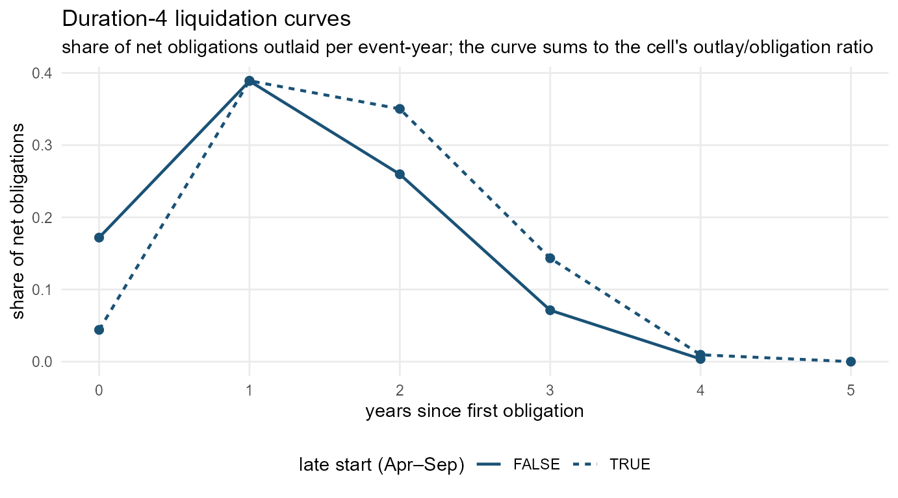

# Fitting an outlay-imputation model

The bundled `outlay_model` was fitted on 2,785 ground-truth awards
pooled from two populations: 51 large nonprofits (the pilot) and a
1,000-organization sample. Each population scores best on curves fitted
to itself (`IMPUTATION.md` §7), so if your portfolio looks different —
other agencies, other award durations, another era — refit on your own
ground truth. The whole pipeline is three calls: **retrieve**
([`us_outlay_training()`](https://nonprofit-open-data-collective.github.io/usaspend/reference/us_outlay_training.md)),
**inspect/extend features**
([`us_outlay_features()`](https://nonprofit-open-data-collective.github.io/usaspend/reference/us_outlay_features.md)),
**fit and evaluate**
([`us_impute_fit()`](https://nonprofit-open-data-collective.github.io/usaspend/reference/us_impute_fit.md),
[`us_impute_eval()`](https://nonprofit-open-data-collective.github.io/usaspend/reference/us_impute_eval.md)).

``` r
library(usaspend)
library(data.table)
```

## 1. Retrieve: build a training set

[`us_outlay_training()`](https://nonprofit-open-data-collective.github.io/usaspend/reference/us_outlay_training.md)
does the whole ground-truth screen: award features from your transaction
ledger, annual File C outlays per award (fetched via
[`us_fetch_outlays()`](https://nonprofit-open-data-collective.github.io/usaspend/reference/us_fetch_outlays.md),
one paged request per candidate — sustained pulls beyond ~1,000 requests
can trip a temporary host block, so large pulls are worth caching),
linkage, and the two truth tiers.

``` r
tx <- us_normalize_transactions(my_extract$transactions)
tr <- us_outlay_training(tx)          # fetches File C for every candidate
# or, with a cached pull:
tr <- us_outlay_training(tx, funding = my_cached_funding)
```

This vignette works offline with the bundled set:

``` r
tr <- outlay_training
tr
#> 
#> ── outlay-imputation training set ────────────────────────────────────────────────────────
#> • 14022 candidate awards, 2785 ground truth
#> • 2464 reconciled, 321 shape-complete
#> • 8719 award-year rows, as of FY2026
tr$awards[!is.na(tier), .N, by = .(tier, mod_class)][order(tier, -N)]
#>               tier              mod_class     N
#>             <char>                 <char> <int>
#>  1:     reconciled            single_year  1390
#>  2:     reconciled multi_year_incremental   448
#>  3:     reconciled                reduced   276
#>  4:     reconciled     extension_timeline   263
#>  5:     reconciled       extension_funded    87
#>  6: shape_complete multi_year_incremental   128
#>  7: shape_complete                reduced    75
#>  8: shape_complete            single_year    44
#>  9: shape_complete     extension_timeline    43
#> 10: shape_complete       extension_funded    31
```

### How the retrieval filters, and why

The screens are deliberate, not incidental — an award whose File C
records don’t reconcile with its own ledger, or whose cash story is
censored, teaches the model the reporting system instead of the
spending. In order:

1.  **Candidates**: first obligated FY2020+ with material net
    obligations. The floor is not arbitrary — account-level outlay
    reporting became mandatory (monthly) only in **FY2022**, with COVID
    awards from April 2020 and effectively optional coverage before.
    Earlier awards have permanently unreported cash and *cannot* be
    ground truth.
2.  **Linkage**: File C lifetime obligations must reconcile with the
    award’s own transaction ledger within 10%. Unlinkable File C records
    describe money that cannot be tied to the award.
3.  **A finished cash story**: either lifetime outlays ≈ net obligations
    with cash no longer flowing (`tier = "reconciled"`), or a
    mandate-era start with a completed, plateaued series
    (`tier = "shape_complete"` — the level may fall short but the timing
    profile is fully observed).

The sample frame is therefore **shaped by the 2022 mandate**: recent,
shorter awards from agencies that report. That has two consequences
worth stating before fitting. First, the *support envelope* — long
awards are scarce (few 5+ year awards have completed inside the window),
so the model declines to speak for them. Second, **agency selection**:
outlay coverage varies enormously by agency — DoD reports File C
obligations but essentially no outlays (median outlay/obligation ratio
0.00), Commerce 0.24, versus NSF, USDA, and NASA at 1.00 and HHS at
0.91. Agencies that don’t report cash contribute *no* ground truth, so
the fitted curves are estimated from the reporters. If the level of
outlay reporting is correlated with your outcome of interest, and
liquidation shapes differ across agencies, the imputed values carry that
selection signature — a DoD-heavy portfolio is being imputed with curves
learned mostly from HHS-and-NSF-style awards. Check your portfolio’s
agency mix against the training mix
(`tr$awards[!is.na(tier), .N, by = awarding_agency_name]`) before
leaning on the imputations, and consider agency cells
(`cells = c("dur_bin", "late_start", ...)`) where your ground truth is
deep enough to support them.

Tiers, thresholds and rationale are specified in `IMPUTATION.md` §1.

## 2. Features

[`us_outlay_features()`](https://nonprofit-open-data-collective.github.io/usaspend/reference/us_outlay_features.md)
is the shared feature layer — the training builder calls it, and
[`us_impute_outlays()`](https://nonprofit-open-data-collective.github.io/usaspend/reference/us_impute_outlays.md)
calls it again at prediction time, so anything you compute here is
available on both sides.

``` r
f <- us_outlay_features(us_normalize_transactions(vumc_transactions))
f[, .N, by = .(dur_bin, late_start)][order(dur_bin, late_start)][1:8]
#>    dur_bin late_start     N
#>      <int>     <lgcl> <int>
#> 1:       1      FALSE    64
#> 2:       1       TRUE    42
#> 3:       2      FALSE    63
#> 4:       2       TRUE   158
#> 5:       3      FALSE    53
#> 6:       3       TRUE   241
#> 7:       4      FALSE    68
#> 8:       4       TRUE   212
```

The default model cells are `dur_bin` (award duration in fiscal years,
capped at 6) × `late_start` (first obligated April–September) ×
`short_family` (award family for one- and two-year awards: grant,
contract or other; `"any"` for longer ones). The original experiment
tested award *type* as a third dimension and found it added nearly
nothing in a grant-dominated sample; pooling in a 1,000-organization
sample, where short awards are mostly direct payments, changed that for
short awards only (`IMPUTATION.md` §7). The `cells` argument takes any
feature columns present in the grid, so a portfolio where something else
matters can use it — and cells too thin to fit (fewer than `min_cell`
awards) fall back to the duration curve.

## 3. Fit

``` r
m <- us_impute_fit(tr, min_cell = 8)
m
#> 
#> ── liquidation-curve outlay model ────────────────────────────────────────────────────────
#> • fitted on 2785 ground-truth awards (as of FY2026)
#> • cells: dur_bin x late_start x short_family, min cell 8
#> • global outlay/obligation ratio 0.92
#> • durations supported: 1 (n=529), 2 (n=676), 3 (n=717), 4 (n=633), 5 (n=97), 6 (n=133)
```

The fitted object is transparent — plain curve tables you can inspect
and plot. The duration-4 curves show both regularities the model banks
on: the lag (mass at years 1–2) and the late-start shift (the `TRUE`
curve barely spends in year 0):

``` r
library(ggplot2)
#> Warning: package 'ggplot2' was built under R version 4.4.3
cc <- m$curves_cell[dur_bin == 4 & n >= m$min_cell]
ggplot(cc, aes(t, share, linetype = late_start)) +
  geom_line(colour = "#1a5276", linewidth = 0.8) +
  geom_point(colour = "#1a5276", size = 2) +
  labs(title = "Duration-4 liquidation curves",
       subtitle = "share of net obligations outlaid per event-year; the curve sums to the cell's outlay/obligation ratio",
       x = "years since first obligation", y = "share of net obligations",
       linetype = "late start (Apr–Sep)") +
  theme_minimal(base_size = 11) +
  theme(legend.position = "bottom", panel.grid.minor = element_blank())
```



## 4. Evaluate

[`us_impute_eval()`](https://nonprofit-open-data-collective.github.io/usaspend/reference/us_impute_eval.md)
refits out-of-fold and scores against the two reference rules on both
metrics — `timing` (misallocation share, level normalized away) and
`level_timing` (the method is charged for missing the cash level too).

``` r
ev <- us_impute_eval(tr, folds = 5)
ev$summary
#>    metric       method  mean median dollar_weighted
#>    <char>       <char> <num>  <num>           <num>
#> 1:  level        model 0.350  0.303           0.350
#> 2:  level  even_spread 0.453  0.469           0.442
#> 3:  level as_obligated 0.745  0.884           0.734
#> 4: timing        model 0.340  0.291           0.314
#> 5: timing  even_spread 0.441  0.459           0.407
#> 6: timing as_obligated 0.658  0.829           0.648
ev$by_class
#>                 mod_class     n model as_obligated even_spread
#>                    <char> <int> <num>        <num>       <num>
#> 1:       extension_funded   118 0.332        0.589       0.376
#> 2:     extension_timeline   306 0.316        0.848       0.427
#> 3: multi_year_incremental   576 0.347        0.699       0.460
#> 4:                reduced   351 0.358        0.694       0.490
#> 5:            single_year  1434 0.338        0.598       0.430
```

Read `ev$by_class` before trusting the model on a skewed portfolio:
`reduced` awards are the hardest class for every method, and a portfolio
dominated by them deserves wider error bars, not a better point
estimate.

## 5. Use it

A fitted model drops into the imputation functions anywhere the bundled
one would be used:

``` r
tx  <- us_normalize_transactions(us_sample_extract()$transactions)
imp <- us_impute_outlays(tx, model = m)
imp[, .(dollars = round(sum(outlay_imputed))), by = imputation_method]
#>    imputation_method  dollars
#>               <char>    <num>
#> 1:              none        0
#> 2: liquidation_curve 25551466
```

``` r
saveRDS(m, "outlay-model-2026.rds")          # reuse across sessions
p <- us_panel(my_extract, period = "fiscal")
p <- us_add_imputed_outlays(p, model = m)
```

Refit when your ground truth grows — every fiscal year that closes moves
more awards through the truth screens, and the support envelope (the
durations the model will speak for) widens with it.
