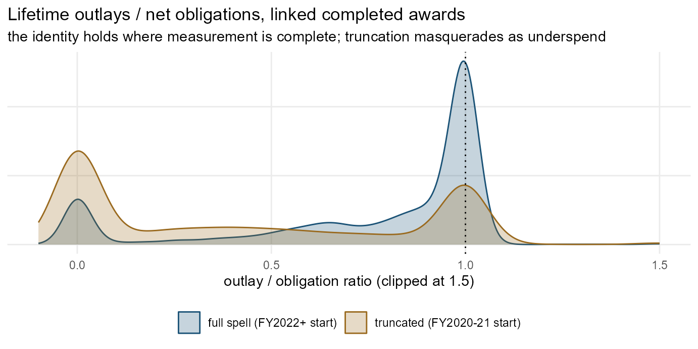
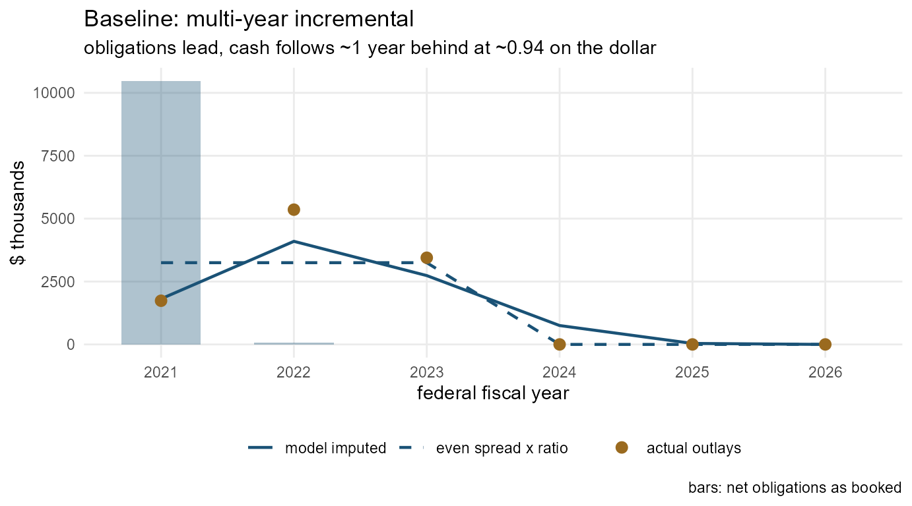
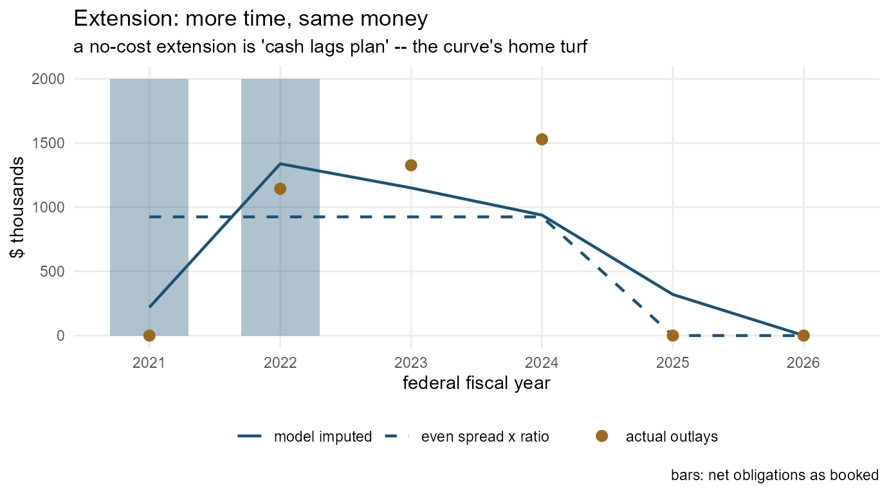
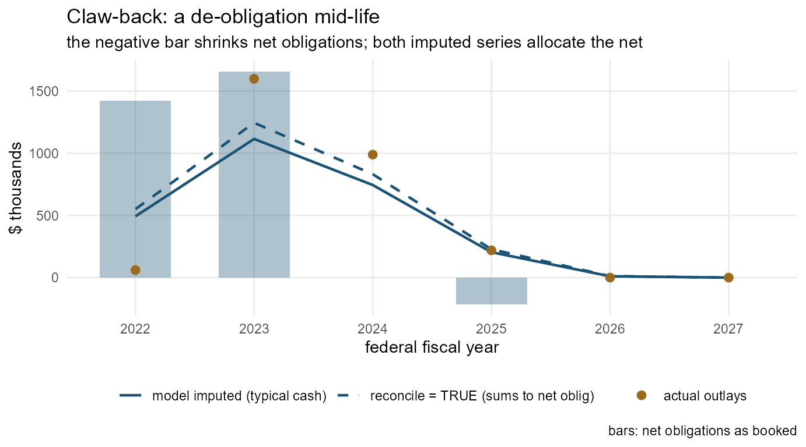
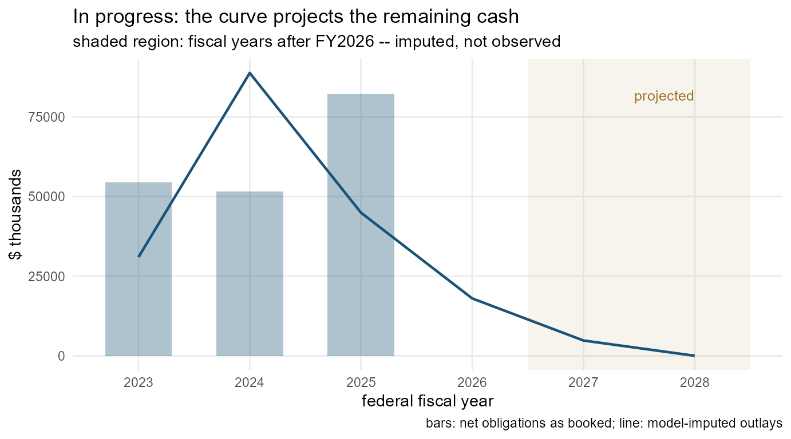

# Imputing outlays: turning promises into a cash calendar

Federal award data reports **obligations** — the year money was
promised. The cash — the **outlay** — arrives on its own schedule, and
the two differ widely: measured on the package’s ground truth,
obligations put a median 90% of an award’s dollars in its first fiscal
year while cash puts 2% there, lags the commitment by roughly a year,
and totals a median 94 cents per obligated dollar. Real annual outlays
exist only in account-level File C data, complete only from the FY2022
monthly mandate and missing for whole agencies
([`vignette("data-model")`](https://nonprofit-open-data-collective.github.io/usaspend/articles/data-model.md)).
For everything else, this vignette’s tools *impute* a cash calendar from
the obligations side.

Everything here runs offline on two bundled objects: `outlay_training`
(2,785 awards whose File C cash story is fully trustworthy, pooled from
the 50-nonprofit pilot and a 1,000-organization sample — the ground
truth documented in `IMPUTATION.md`) and `outlay_model` (the default
model fitted on it).

``` r
library(usaspend)
library(data.table)
outlay_model
```

## The model: a liquidation curve

For each award-duration × start-timing cell, the model stores the mean
share of an award’s **net obligations** outlaid in each event-year `t`
(years since first obligation). One- and two-year awards are split once
more, by award family — grant, contract, or other (mostly direct
payments, which turn into cash almost at once). One object carries all
three measured regularities:

- **the lag** — the curve’s mass sits in years 1–2, not year 0;
- **the late-start shift** — an award first obligated April–September
  pushes most of its first-year cash into the next fiscal year, so
  `late_start` cells have flatter year-0 shares;
- **the outlay/obligation ratio** — the curve’s *sum* is the cell’s
  liquidation ratio (globally 0.92), so imputed totals land at realistic
  cash levels, not at the obligation level.

``` r
outlay_model$curves_dur[dur_bin == 4]
#> Key: <dur_bin>
#>    dur_bin     t        share     n
#>      <int> <int>        <num> <int>
#> 1:       4     0 0.0763453715   633
#> 2:       4     1 0.3891211323   633
#> 3:       4     2 0.3273282667   633
#> 4:       4     3 0.1250985812   633
#> 5:       4     4 0.0080780603   633
#> 6:       4     5 0.0000087693   633
```

**Be precise about what the model returns.** It is the *typical payment
schedule given the observed obligation schedule* — a prediction of what
cash usually does, in shape and in level — not an accounting identity.
The zero-filled estimator makes the level exact by construction: each
curve’s sum equals its cell’s mean observed lifetime ratio, so every
model-imputed award totals (cell ratio × net obligations), never net
obligations themselves. When an analysis needs the accounting identity
instead — outlays that tie out exactly to the obligations ledger —
`reconcile = TRUE` rescales each award’s series to sum to its net
obligations (see below).

The scoring metric is the **misallocation share** — the fraction of an
award’s dollars placed in the wrong fiscal year
([`us_misallocation()`](https://nonprofit-open-data-collective.github.io/usaspend/reference/us_misallocation.md);
`IMPUTATION.md` §3 explains why this beats correlation for an allocation
task). Cross-validated on the pooled ground truth, the model scores 0.34
mean / 0.29 median (timing) and 0.35 / 0.30 (level + timing) against
0.44/0.45 for even spread and 0.66/0.75 for booking cash in the
commitment year. The pilot’s awards score 0.30 and the sample’s 0.37 —
the sample’s truth is harder under every method (even spread: 0.41
against 0.47).

## The typical pattern, and the state of the real data

The accounting theory says outlays should equal obligations: money
obligated is eventually either paid or de-obligated, so the two ledgers
converge at closeout. The data agrees *where measurement allows* —
awards with full reporting coverage and two-plus years to liquidate
reach a median lifetime outlay/obligation ratio of exactly 1.00. The
typical pattern the model banks on is therefore: **year-one cash near
zero, the mass arriving one to two years behind the commitments,
converging toward the obligation total as the award closes out.**

Published outlays diverge from the identity for reasons that are mostly
*measurement*, and the fetch layer was built around them:

- **Reporting truncation.** Account-level outlay reporting was mandated
  monthly only from FY2022 (COVID awards from April 2020; optional and
  quarterly before). Pre-mandate cash was never reported, not never paid
  — so
  [`us_fetch_outlays()`](https://nonprofit-open-data-collective.github.io/usaspend/reference/us_fetch_outlays.md)
  output is graded per award, and awards straddling the mandate are
  marked `truncated_pre_FY2022` rather than letting missing years read
  as zero cash.
- **Agency practice.** Whole agencies publish obligations without
  outlays; coverage gaps become `no_file_c` / `no_outlay_rows` grades,
  and unlinkable records become `unlinked`, with `NA` dollars — never
  fabricated zeros.
- **Liquidation in progress.** Clean-era awards read 0.90 a year after
  the performance end, 1.00 only at three years; closeout de-obligations
  post later still.

The distribution makes the story visible. Among the training candidates
that are linked and completed, the ratio for **full-spell** awards
(first obligated FY2022+, whole cash history inside the mandate) piles
up near 1; **truncated** awards (FY2020–21 starts, early cash
unreported) smear across the low ratios:

    #> Warning: package 'ggplot2' was built under R version 4.4.3



Two features of the shape are worth naming. The spike at exactly 0 is
non-reporting agencies, not zero spending. And ratios *above* 1 are
real: a de-obligation that posts after the cash already went out shrinks
the denominator — the same mechanism that makes claw-back awards the
hardest imputation class (drawn below).

## Imputing

[`us_impute_outlays()`](https://nonprofit-open-data-collective.github.io/usaspend/reference/us_impute_outlays.md)
takes any canonical transaction table and returns imputed dollars per
award × fiscal year. It never returns `NA` dollars: awards outside the
model’s *support envelope* — durations the training data cannot vouch
for, missing period-of-performance dates — fall back to the basic rule
*global ratio × (net obligations / performance periods)*, and
`imputation_method` says which rule produced each row.

``` r
tx  <- us_normalize_transactions(us_sample_extract()$transactions)
imp <- us_impute_outlays(tx)
imp[, .(awards = uniqueN(award_key), dollars = round(sum(outlay_imputed))),
    by = imputation_method]
#>    imputation_method awards  dollars
#>               <char>  <int>    <num>
#> 1:              none      6        0
#> 2: liquidation_curve     12 25551466
```

With `reconcile = TRUE`, each award’s series is rescaled so imputed cash
sums **exactly** to net obligations — the accounting identity most
analyses of spending or revenue want, with the model contributing the
timing (for an in-progress award the identity holds over its full
projected life, not the partial window observed so far):

``` r
imp_r <- us_impute_outlays(tx, reconcile = TRUE)
merge(imp_r[, .(imputed = round(sum(outlay_imputed))), by = award_key],
      us_outlay_features(tx)[, .(award_key, oblig = round(oblig))],
      by = "award_key")[oblig > 0][1:5]
#> Key: <award_key>
#>                                                    award_key imputed   oblig
#>                                                       <char>   <num>   <num>
#> 1:                                ASST_NON_HDTRA12310001_097 1300000 1300000
#> 2:                 CONT_AWD_73351023P0025_7300_-NONE-_-NONE-   62100   62100
#> 3:                 CONT_AWD_FA875018C0013_9700_-NONE-_-NONE- 7598606 7598606
#> 4:                 CONT_AWD_FA875019C0203_9700_-NONE-_-NONE- 5098414 5098414
#> 5: CONT_AWD_HHSD2002007200320001_7523_HHSD200200720032I_7523  281586  281586
```

[`us_add_imputed_outlays()`](https://nonprofit-open-data-collective.github.io/usaspend/reference/us_add_imputed_outlays.md)
appends the same numbers to a fiscal panel as `outlay_imputed`, adding
rows (flagged `imputed_outlay_only_year`) for years the curve allocates
cash to but the panel has no activity row for — including *future* years
of ongoing awards, which is the point.

``` r
p <- us_panel(us_sample_extract(), period = "fiscal")
#> Warning: No outbound subawards present -- pass-through cannot be netted out.
#> ℹ Bulk downloads match on the subawardee. Use `us_fetch_subawards_out()` to fetch
#>   pass-through by prime award.
p <- us_add_imputed_outlays(p)
p$panel[, .(obligations = round(sum(obligation_net)),
            imputed_cash = round(sum(outlay_imputed))), by = year][order(year)][1:8]
#>     year obligations imputed_cash
#>    <int>       <num>        <num>
#> 1:  2008           0            0
#> 2:  2009       17370        45917
#> 3:  2010      309991        79154
#> 4:  2011      405951       107665
#> 5:  2012     1846021       333920
#> 6:  2013        7086       575481
#> 7:  2014      320901       551651
#> 8:  2015       27370       496365
```

## Four cases, drawn

Each panel below shows the same three series for one real award:
**obligations** as booked (bars), the **model’s imputed outlays** (solid
line), and the naive **even spread** — average annual net obligation
scaled by the global ratio (dashed). For the first three cases the award
is in the ground truth, so the **actual File C outlays** (points)
referee.

### 1. Baseline: a multi-year incremental award

The planned rhythm — obligations arrive as annual continuations, cash
shadows them a year behind. The model’s curve reproduces both the lag
and the sub-1.0 level; even spread gets the level roughly right but
flattens the shape.



### 2. An extended award

The period of performance was pushed out past the original end date. The
obligations stop but the cash keeps flowing through the extension — the
liquidation curve’s tail covers exactly those trailing years, where the
even spread (built on the *final* window) dilutes every year instead.



### 3. A claw-back (reduced award)

De-obligations claw money back — the negative bar. In the accounting,
the claw-back *reduces net obligations*, so both the model and the
`reconcile = TRUE` series allocate the smaller net figure, never the
gross that was briefly on the books. This is the hardest class for every
method: the cash that flowed before the claw-back tracked the *original*
plan, and a ratio above 1 is even possible when the de-obligation posts
after the money went out. The honest read is the imputation plus a wider
error bar, which is why
[`us_outlay_features()`](https://nonprofit-open-data-collective.github.io/usaspend/reference/us_outlay_features.md)
flags `mod_class == "reduced"`.



### 4. Right-censored: an award still in progress

For an ongoing award there is nothing to referee against — that is the
point of imputation. The curve projects the remaining cash into future
fiscal years (shaded); the panel gains those rows flagged
`imputed_outlay_only_year`.



## What to remember

- Imputed outlays are a **modelled cash calendar**, good to roughly a
  fifth to a quarter of dollars misallocated on trustworthy ground
  truth. Where real File C outlays exist
  ([`us_add_outlays()`](https://nonprofit-open-data-collective.github.io/usaspend/reference/us_add_outlays.md),
  coverage graded), prefer them; imputation is for everywhere they
  don’t.
- Default output is the **typical payment schedule** (level ≈ 0.94 of
  net obligations, what completed awards actually deliver);
  `reconcile = TRUE` imposes the **accounting identity** (imputed cash
  sums exactly to net obligations) — the right configuration when the
  dollars must tie out to the obligations ledger.
- `imputation_method` and `imputation_flags` travel with every number —
  report them. A `reduced` award deserves a wider error bar; an
  `even_spread` row means the model declined to guess beyond its
  support.
- Fitting your own model on your own ground truth is a few lines:
  [`vignette("imputation-fitting")`](https://nonprofit-open-data-collective.github.io/usaspend/articles/imputation-fitting.md).
